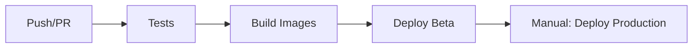
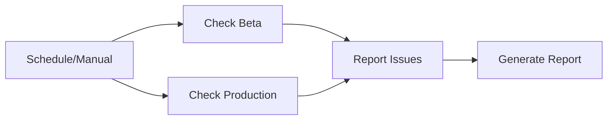
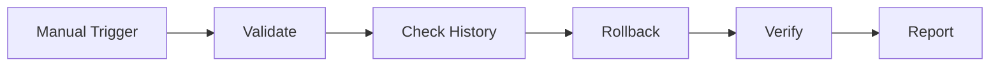
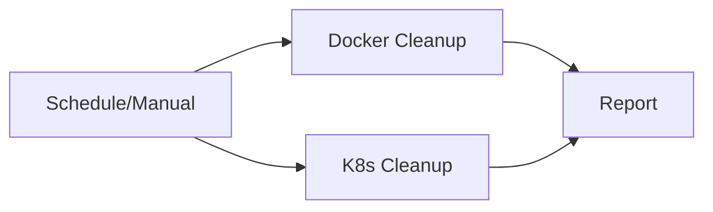

# 🚀 **GitHub Actions Workflows - Financial Resume Engine**

## 📁 **Estructura de Workflows**

```
.github/workflows/
├── ci-cd.yml           # 🚀 Pipeline principal CI/CD
├── health-checks.yml   # 🏥 Health checks y monitoring
├── rollback.yml        # 🔄 Rollback de deployments
├── cleanup.yml         # 🧹 Cleanup y mantenimiento
└── README.md           # 📚 Esta documentación
```

## 🎯 **Workflows Disponibles**

### **1. 🚀 CI/CD Pipeline (ci-cd.yml)**
**Propósito:** Pipeline principal para testing, build y deployment

**Triggers:**
- ✅ **Automático:** Push a branch `main` → Deploy a Beta
- ✅ **Manual:** Workflow dispatch → Deploy a Beta o Producción

**Flujo:**


**Jobs:**
- **🧪 Test:** Linting, tests unitarios, cobertura
- **🏗️ Build:** Construcción y push de imágenes Docker
- **🧪 Deploy Beta:** Deployment automático a ambiente beta
- **🚀 Deploy Production:** Deployment manual a producción

**Uso:**
```bash
# Automático: Push a main
git push origin main

# Manual: Ir a Actions → CI/CD Pipeline → Run workflow
# Seleccionar environment: beta | production
```

---

### **2. 🏥 Health Checks (health-checks.yml)**
**Propósito:** Monitoreo continuo de la salud de los ambientes

**Triggers:**
- ✅ **Automático:** Cada 5 minutos
- ✅ **Manual:** Workflow dispatch

**Flujo:**


**Jobs:**
- **🧪 Health Check Beta:** Verifica pods y endpoints
- **🚀 Health Check Production:** Verifica producción
- **📊 Resource Usage:** Reporte de uso de recursos

**Alertas:**
- **Beta falla:** Crea issue automáticamente
- **Producción falla:** Crea issue crítico + notificación

**Uso:**
```bash
# Ver en Actions → Health Checks & Monitoring
# Ejecutar manual: Run workflow → Seleccionar environment
```

---

### **3. 🔄 Rollback (rollback.yml)**
**Propósito:** Rollback a versiones anteriores en caso de fallos

**Triggers:**
- ✅ **Manual únicamente:** Workflow dispatch

**Flujo:**


**Jobs:**
- **🔍 Validate:** Confirma intención de rollback
- **🔄 Rollback:** Ejecuta rollback paso a paso
- **🔍 Verify:** Verifica éxito del rollback

**Uso:**
```bash
# 1. Ir a Actions → Rollback Deployment
# 2. Run workflow
# 3. Llenar formulario:
#    - Environment: beta | production
#    - Rollback steps: 1 | 2 | 3
#    - Confirm: "CONFIRM"
#    - Reason: "Descripción del problema"
```

**⚠️ Seguridad:**
- Requiere confirmación explícita
- Logs detallados de la operación
- Verificación post-rollback

---

### **4. 🧹 Cleanup (cleanup.yml)**
**Propósito:** Limpieza automática de recursos y mantenimiento

**Triggers:**
- ✅ **Automático:** Domingos a las 2 AM UTC
- ✅ **Manual:** Workflow dispatch

**Flujo:**


**Jobs:**
- **🐳 Docker Cleanup:** Limpia imágenes >7 días
- **☸️ Kubernetes Cleanup:** Limpia pods fallidos, ReplicaSets
- **📋 Report:** Genera reporte de mantenimiento

**Uso:**
```bash
# Automático: Cada domingo
# Manual: Actions → Cleanup & Maintenance → Run workflow
#   - Cleanup type: all | docker-images | old-deployments | failed-pods
#   - Dry run: true | false
```

---

## 🔧 **Configuración y Secrets**

### **Secrets Requeridos:**
```yaml
# GCP Configuration
GCP_PROJECT_ID: "financial-resume-prod-464920"
GCP_SERVICE_ACCOUNT_KEY: "{...}" # JSON completo

# Database
DB_PASSWORD: "tu_password_seguro"

# Redis
REDIS_HOST: "10.85.91.171"

# Services
OPENAI_API_KEY: "sk-proj-..."
JWT_SECRET: "tu_jwt_secret_seguro"
```

### **Variables de Entorno:**
```yaml
# En ci-cd.yml
GCP_REGION: "southamerica-east1"
GKE_CLUSTER: "financial-resume-cluster"
```

---

## 🎮 **Cómo Usar los Workflows**

### **🚀 Deployment Normal**
```bash
# 1. Desarrollar feature
git checkout -b feature/nueva-funcionalidad
git add .
git commit -m "feat: nueva funcionalidad"

# 2. Push y crear PR
git push origin feature/nueva-funcionalidad
# Crear PR en GitHub → Ejecuta tests automáticamente

# 3. Merge a main
# Automáticamente despliega a Beta

# 4. Verificar en Beta
# Ir a Actions → Ver URL de Beta en los logs

# 5. Deploy a Producción (manual)
# Actions → CI/CD Pipeline → Run workflow
# Environment: production
```

### **🚨 Manejo de Emergencias**
```bash
# 1. Detectar problema en producción
# Health checks crean issue automáticamente

# 2. Decidir acción
# Opción A: Rollback
# Actions → Rollback Deployment
# Environment: production
# Confirm: "CONFIRM"
# Reason: "Problema crítico en producción"

# Opción B: Hotfix
# Crear branch hotfix, fix, deploy
```

### **🔍 Monitoreo y Mantenimiento**
```bash
# Ver health checks
# Actions → Health Checks & Monitoring → Ver últimas ejecuciones

# Ejecutar mantenimiento manual
# Actions → Cleanup & Maintenance → Run workflow
# Dry run: true (para preview)

# Ver reportes de recursos
# Actions → Health Checks → Resource Usage Report
```

---

## 📊 **Ambientes y URLs**

### **🧪 Beta Environment**
- **Namespace:** `beta`
- **URL:** Se muestra en logs de deployment
- **Propósito:** Testing con usuarios reales
- **Deployment:** Automático en cada push a `main`

### **🚀 Production Environment**
- **Namespace:** `production`
- **URL:** Se muestra en logs de deployment
- **Propósito:** Usuarios finales
- **Deployment:** Manual únicamente

---

## 🔄 **Estrategia de Versioning**

### **Tags Automáticos:**
```bash
# Beta deployments
beta-a1b2c3d  # beta + short SHA

# Production deployments
prod-a1b2c3d  # prod + short SHA
```

### **GitHub Releases:**
- Se crea automáticamente en deployments a producción
- Incluye changelog y links a la aplicación
- Permite tracking de versiones

---

## 🛡️ **Seguridad y Permisos**

### **Environments:**
- **Beta:** Sin restricciones
- **Production:** Requiere aprobación manual

### **Secrets:**
- Almacenados en GitHub Secrets
- Nunca se muestran en logs
- Acceso limitado a workflows autorizados

### **Permisos:**
- Service Account con permisos mínimos necesarios
- Separación de environments
- Logging detallado para auditoría

---

## 📈 **Métricas y Monitoring**

### **Métricas Automáticas:**
- **Deployment frequency:** Cada push a main
- **Lead time:** Tiempo desde commit hasta producción
- **MTTR:** Tiempo de recuperación con rollback
- **Success rate:** % de deployments exitosos

### **Dashboards:**
- **GitHub Actions:** Historial de execuciones
- **GCP Console:** Métricas de Kubernetes
- **Issues:** Tracking de problemas automáticos

---

## 🚨 **Troubleshooting**

### **Problemas Comunes:**

**1. Fallo en Tests:**
```bash
# Ver logs en Actions → CI/CD Pipeline → Test job
# Fixear tests localmente
# Push nuevo commit
```

**2. Fallo en Build:**
```bash
# Verificar Dockerfile
# Verificar secrets de GCP
# Verificar permisos de Container Registry
```

**3. Fallo en Deployment:**
```bash
# Verificar clusters GKE
# Verificar secrets de Kubernetes
# Verificar manifiestos K8s
```

**4. Health Checks Fallando:**
```bash
# Verificar pods: kubectl get pods -n beta
# Verificar logs: kubectl logs -f deployment/app -n beta
# Verificar LoadBalancer: kubectl get services -n beta
```

### **Comandos de Debugging:**
```bash
# Conectar a GKE
gcloud container clusters get-credentials financial-resume-cluster \
  --region southamerica-east1

# Ver estado general
kubectl get pods -A
kubectl get services -A
kubectl get events -A --sort-by=.metadata.creationTimestamp

# Logs específicos
kubectl logs -f deployment/financial-resume-engine -n beta
kubectl describe pod <pod-name> -n beta
```

---

## 🔗 **Enlaces Útiles**

- **GitHub Actions:** [Repositorio]/actions
- **GCP Console:** https://console.cloud.google.com/
- **Kubernetes Dashboard:** Configurar si es necesario
- **Monitoring:** Health checks automáticos

---

## 📚 **Próximos Pasos**

1. **Primer Deployment:**
   - Hacer push a main
   - Verificar deployment automático a Beta
   - Testear aplicación en Beta
   - Deploy manual a Producción

2. **Configurar Alertas:**
   - Configurar notificaciones por email/Slack
   - Configurar webhooks si es necesario

3. **Optimización:**
   - Monitorear tiempos de deployment
   - Optimizar recursos basado en métricas
   - Ajustar health checks según necesidades

4. **Documentación:**
   - Mantener esta documentación actualizada
   - Documentar cambios en la infraestructura
   - Crear runbooks para operaciones comunes 