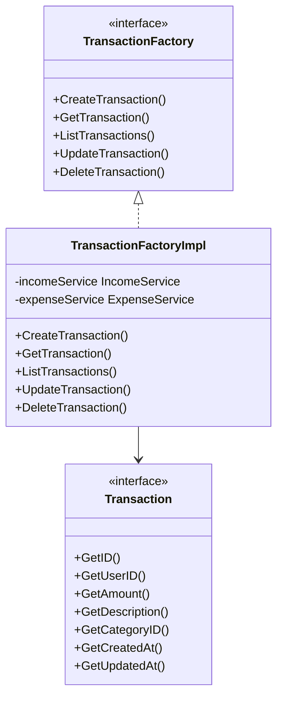
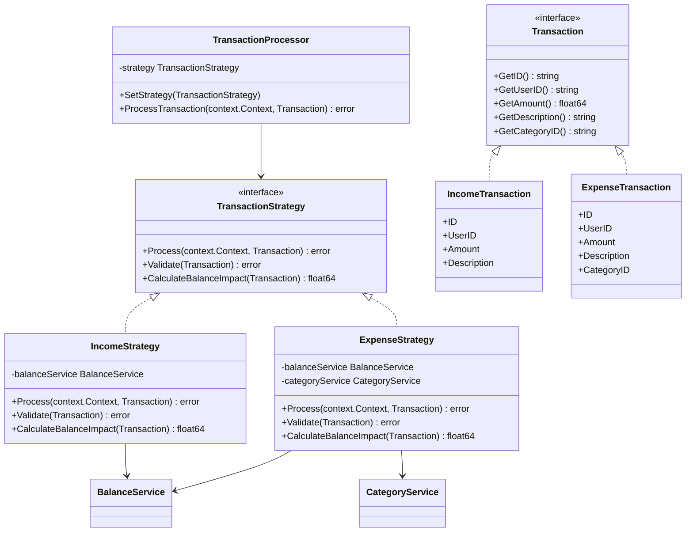
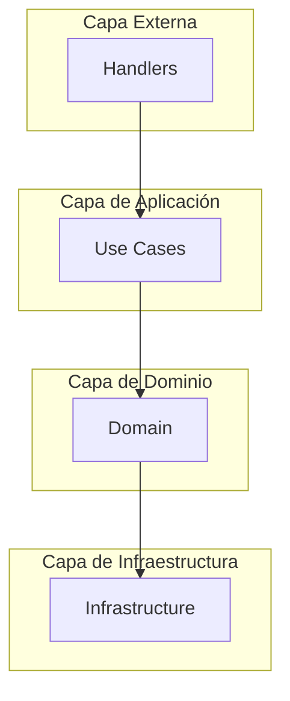
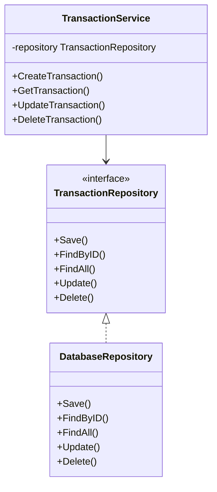
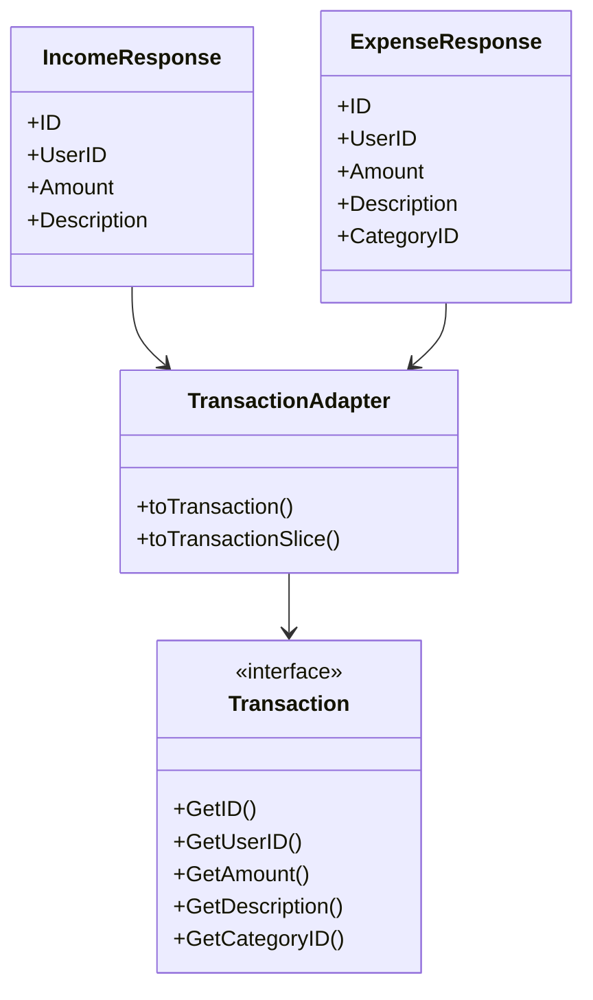
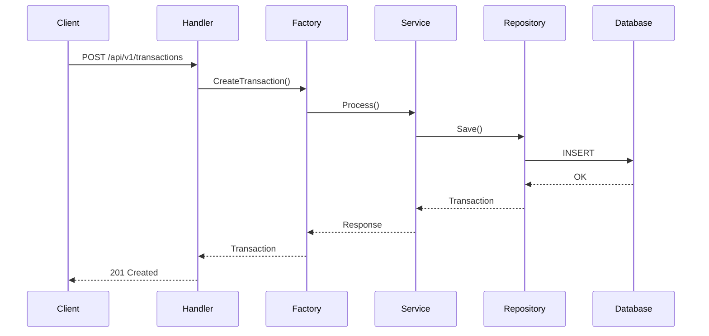
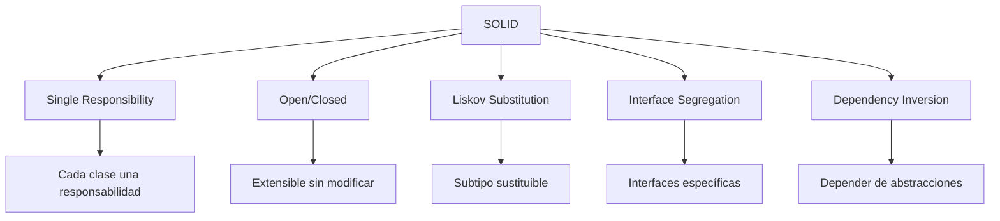
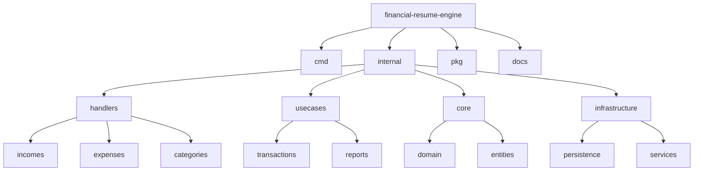
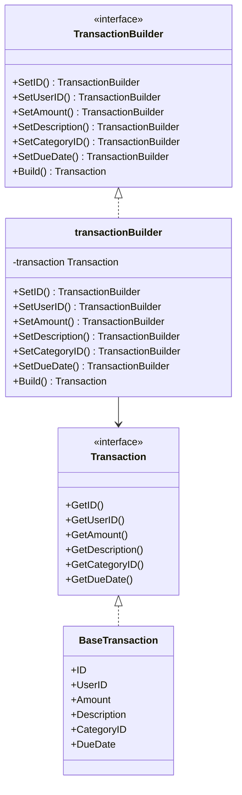
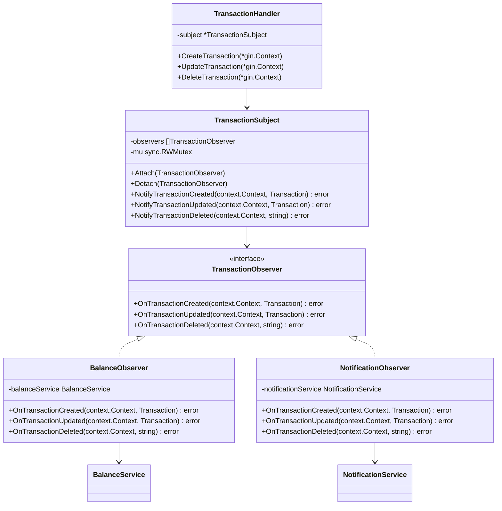

# Diagramas de Patrones de Diseño

## 1. Patrón Factory

## 2. Patrón Strategy

## 3. Clean Architecture

## 4. Patrón Repository

## 5. Patrón Adapter

## 6. Flujo de una Transacción

## 7. Principios SOLID

## 8. Estructura de Directorios

## 9. Patrón Builder

## 10. Patrón Observer

