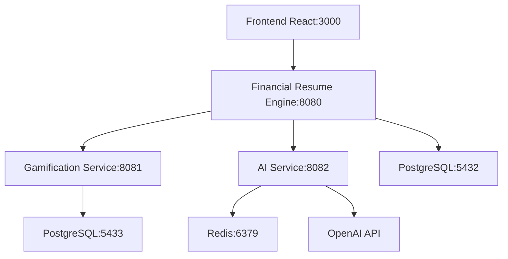
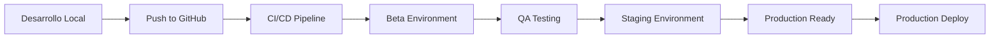

# 🚀 **ESTRATEGIA DE DESPLIEGUE EN PRODUCCIÓN - FINANCIAL RESUME ECOSYSTEM**
*Documento creado: Enero 2025*

## 📋 **RESUMEN EJECUTIVO**

Este documento define la estrategia completa de despliegue para el ecosistema **Financial Resume Engine** en producción, incluyendo ambientes de testing (beta), integración continua, y plan de escalabilidad a largo plazo. La estrategia está diseñada para ser **escalable, mantenible y cost-effective**, considerando el crecimiento proyectado hacia unicornio fintech.

### **🎯 OBJETIVO PRINCIPAL**
Desplegar un ecosistema de microservicios robusto que soporte:
- **20 usuarios** en 6 meses (Beta MVP)
- **200 usuarios** en año 1 (MVP consolidado)
- **2,000 usuarios** en año 2 (Crecimiento inicial)
- **20,000 usuarios** en año 3-5 (Escalabilidad)

---

## 🏗️ **ARQUITECTURA ACTUAL DEL ECOSISTEMA**

### **📦 SERVICIOS IMPLEMENTADOS**

```yaml
Servicios en Producción:
  - financial-resume-engine:        # Servicio principal
      puerto: 8080
      tecnología: Go + Gin + PostgreSQL
      funcionalidades: Core financiero, API Gateway, Auth JWT
      
  - financial-gamification-service: # Microservicio independiente  
      puerto: 8081
      tecnología: Go + PostgreSQL independiente
      funcionalidades: Sistema XP, niveles, achievements
      
  - financial-ai-service:           # Microservicio IA
      puerto: 8082
      tecnología: Go + OpenAI GPT-4 + Redis
      funcionalidades: Análisis financiero, decisiones compra
      
  - financial-resume-frontend:      # Frontend SPA
      puerto: 3000
      tecnología: React 18 + Tailwind + PWA
      funcionalidades: 12 páginas completas, UX moderna
```

### **🔗 COMUNICACIÓN ENTRE SERVICIOS**



**📊 Ver diagramas adicionales creados:**
- **Diagrama 1**: Arquitectura completa de despliegue (ambientes y servicios GCP)
- **Diagrama 2**: Flujo detallado de CI/CD pipeline con quality gates
- **Diagrama 3**: Estrategia de escalabilidad por años (MVP → Unicornio)
- **Diagrama 4**: Costos optimizados por fase (20 → 200 → 2K → 20K usuarios)

---

## ☁️ **RECOMENDACIONES DE INFRAESTRUCTURA - GOOGLE CLOUD PLATFORM**

### **🎯 ¿POR QUÉ GOOGLE CLOUD PLATFORM?**

**Ventajas estratégicas para nuestro ecosistema:**

1. **💰 Cost-Effective**: Créditos gratuitos $300 + Free Tier generoso
2. **🚀 Escalabilidad**: Auto-scaling nativo para microservicios
3. **🔒 Seguridad**: Cifrado por defecto, compliance financiero
4. **🌍 Global**: Latencia baja en LATAM (región São Paulo)
5. **🤖 AI/ML**: Integración nativa con servicios de IA
6. **📊 Observabilidad**: Monitoring y logging integrado

### **📋 SERVICIOS GCP RECOMENDADOS**

#### **🏗️ ARQUITECTURA DE PRODUCCIÓN**

```yaml
Production Environment (GCP):
  
  # COMPUTE - Configuración optimizada para 20-200 usuarios
  Google Kubernetes Engine (GKE):
    cluster_type: "Autopilot"         # Más cost-effective para cargas pequeñas
    node_pools:
      - name: "default-pool"
        machine_type: "e2-small"      # 1 vCPU, 2GB RAM (suficiente para inicio)
        min_nodes: 1
        max_nodes: 3
        auto_scaling: true

  # DATABASES - Configuración inicial económica
  Cloud SQL (PostgreSQL):
    instance_type: "db-f1-micro"      # 0.6 vCPU, 0.6GB RAM (Beta MVP)
    # Upgrade a db-g1-small para 200+ usuarios
    storage: "50GB SSD"               # Suficiente para 200 usuarios
    backup: "automated daily"
    high_availability: false          # Activar cuando tengamos >1K usuarios
    
  Cloud Memorystore (Redis):
    tier: "Basic"                     # Más económico para inicio
    memory: "1GB"                     # Suficiente para cache inicial
    version: "Redis 7.0"
    
  # NETWORKING - Configuración simplificada
  Cloud Load Balancer:
    type: "Application Load Balancer"
    ssl_certificates: "managed"
    cdn: "habilitado cuando >500 usuarios"
    
  # STORAGE - Configuración mínima
  Cloud Storage:
    bucket_type: "regional"
    storage_class: "Standard"
    usage: "static assets, backups"
    initial_size: "50GB"
    
  # MONITORING - Configuración básica
  Cloud Monitoring:
    metrics: "system + custom básicos"
    alerting: "email (gratis)"
    advanced_features: "activar con >1K usuarios"
    
  # SECURITY - Configuración esencial
  Cloud IAM:
    service_accounts: "por microservicio"
    rbac: "least privilege"
    advanced_security: "implementar gradualmente"
    
  # CI/CD - Configuración eficiente
  Cloud Build:
    triggers: "GitHub integration"
    build_steps: "multi-stage optimizado"
    concurrent_builds: "2 máximo (suficiente para equipo pequeño)"
```

#### **💰 ESTIMACIÓN DE COSTOS MENSUAL**

```yaml
Costos Estimados (USD/mes):

# FASE 1: Beta MVP (0-20 usuarios - 6 meses)
Beta_MVP_Costs:
  GKE_Cluster: $25        # 1 nodo e2-micro (0.25 vCPU, 1GB RAM)
  Cloud_SQL: $15          # db-f1-micro + backup
  Cloud_Redis: $10        # 1GB Basic tier
  Load_Balancer: $15      # Basic ALB + SSL
  Storage: $2             # 50GB
  Monitoring: $5          # Basic metrics (Free tier)
  Total: $72/mes
  
# FASE 2: MVP Consolidado (20-200 usuarios - Año 1)  
MVP_Costs:
  GKE_Cluster: $50        # 1-2 nodos e2-small auto-scale
  Cloud_SQL: $30          # db-g1-small + backup
  Cloud_Redis: $20        # 1GB Standard
  Load_Balancer: $18      # ALB + SSL
  Storage: $5             # 100GB
  Monitoring: $10         # Basic metrics
  Total: $133/mes
  
# FASE 3: Crecimiento Inicial (200-2K usuarios - Año 2)
Growth_Costs:
  GKE_Cluster: $120       # 2-4 nodos e2-standard-2 auto-scale
  Cloud_SQL: $80          # db-g1-small + replica lectura
  Cloud_Redis: $35        # 2GB Standard
  Load_Balancer: $25      # ALB + CDN básico
  Storage: $10            # 200GB
  Monitoring: $20         # Advanced metrics
  Total: $290/mes
  
# FASE 4: Escalabilidad (2K-20K usuarios - Año 3-5)
Scale_Costs:
  GKE_Cluster: $400       # 4-8 nodos e2-standard-2 auto-scale
  Cloud_SQL: $200         # db-g1-medium + HA
  Cloud_Redis: $70        # 4GB Standard
  Load_Balancer: $35      # Global ALB + CDN
  Storage: $25            # 500GB
  Monitoring: $50         # Enterprise metrics
  Total: $780/mes
```

### **🌍 CONFIGURACIÓN DE REGIONES**

```yaml
Primary_Region: "southamerica-east1"    # São Paulo, Brazil
Secondary_Region: "us-central1"         # Iowa, USA (disaster recovery)

Latencia_Esperada:
  Brasil: "< 20ms"
  Argentina: "< 40ms" 
  México: "< 80ms"
  Colombia: "< 60ms"
```

---

## 🔄 **ESTRATEGIA DE AMBIENTES**

### **🏗️ AMBIENTES PROPUESTOS**

```yaml
Environments:

  # DESARROLLO LOCAL
  development:
    location: "Local Docker Compose"
    purpose: "Desarrollo diario"
    data: "Mock data + test database"
    cost: "$0"
    
  # TESTING/BETA (Simplificado para 20 usuarios)
  beta:
    location: "GCP - Cluster compartido económico"
    purpose: "QA + Beta testing con usuarios reales"
    data: "Synthetic data + 20 beta users"
    users: "< 20 beta testers"
    cost: "$30/mes"
    
  # PRODUCCIÓN (Ambiente único para simplicidad)
  production:
    location: "GCP - Cluster optimizado"
    purpose: "Usuarios reales (20-200)"
    data: "Real user data"
    cost: "$72-290/mes (según crecimiento)"
    notes: "Staging integrado en production con blue-green deploys"
    
  # STAGING (Opcional - Solo si es necesario)
  staging:
    location: "GCP - Mismo cluster que production"
    purpose: "Pre-production testing cuando sea crítico"
    data: "Production-like data"
    cost: "$0 (compartido con production)"
    status: "Activar solo para releases críticos"
```

### **🔀 FLUJO DE DEPLOYMENT**



---

## 🤖 **INTEGRACIÓN CONTINUA CON GITHUB**

### **🔧 GITHUB ACTIONS PIPELINE**

#### **📄 Archivo: `.github/workflows/ci-cd.yml`**

```yaml
name: 'Financial Resume Ecosystem CI/CD'

on:
  push:
    branches: [ main, develop ]
  pull_request:
    branches: [ main ]

env:
  GCP_PROJECT_ID: ${{ secrets.GCP_PROJECT_ID }}
  GCP_SERVICE_ACCOUNT_KEY: ${{ secrets.GCP_SERVICE_ACCOUNT_KEY }}
  GKE_CLUSTER: financial-resume-cluster
  GKE_ZONE: southamerica-east1-a

jobs:
  # TESTING
  test:
    runs-on: ubuntu-latest
    strategy:
      matrix:
        service: [financial-resume-engine, financial-gamification-service, financial-ai-service]
    
    steps:
      - name: Checkout code
        uses: actions/checkout@v3
        
      - name: Setup Go
        uses: actions/setup-go@v3
        with:
          go-version: '1.21'
          
      - name: Run tests
        run: |
          cd ${{ matrix.service }}
          go test -v -race -coverprofile=coverage.out ./...
          
      - name: Upload coverage
        uses: codecov/codecov-action@v3
        with:
          file: ${{ matrix.service }}/coverage.out
          
  # SECURITY SCAN
  security:
    runs-on: ubuntu-latest
    needs: test
    
    steps:
      - name: Checkout code
        uses: actions/checkout@v3
        
      - name: Run Gosec Security Scanner
        uses: securecodewarrior/github-action-gosec@master
        with:
          args: './...'
          
      - name: Run Trivy vulnerability scanner
        uses: aquasecurity/trivy-action@master
        with:
          scan-type: 'fs'
          
  # BUILD & PUSH DOCKER IMAGES
  build:
    runs-on: ubuntu-latest
    needs: [test, security]
    if: github.ref == 'refs/heads/main'
    
    steps:
      - name: Checkout code
        uses: actions/checkout@v3
        
      - name: Setup GCloud CLI
        uses: google-github-actions/setup-gcloud@v1
        with:
          service_account_key: ${{ secrets.GCP_SERVICE_ACCOUNT_KEY }}
          project_id: ${{ env.GCP_PROJECT_ID }}
          
      - name: Configure Docker
        run: gcloud auth configure-docker
        
      - name: Build and push backend services
        run: |
          # Financial Resume Engine
          docker build -t gcr.io/$GCP_PROJECT_ID/financial-resume-engine:$GITHUB_SHA financial-resume-engine/
          docker push gcr.io/$GCP_PROJECT_ID/financial-resume-engine:$GITHUB_SHA
          
          # Gamification Service
          docker build -t gcr.io/$GCP_PROJECT_ID/financial-gamification-service:$GITHUB_SHA financial-gamification-service/
          docker push gcr.io/$GCP_PROJECT_ID/financial-gamification-service:$GITHUB_SHA
          
          # AI Service
          docker build -t gcr.io/$GCP_PROJECT_ID/financial-ai-service:$GITHUB_SHA financial-ai-service/
          docker push gcr.io/$GCP_PROJECT_ID/financial-ai-service:$GITHUB_SHA
          
      - name: Build and push frontend
        run: |
          # Frontend
          docker build -t gcr.io/$GCP_PROJECT_ID/financial-resume-frontend:$GITHUB_SHA financial-resume-engine-frontend/
          docker push gcr.io/$GCP_PROJECT_ID/financial-resume-frontend:$GITHUB_SHA
          
  # DEPLOY TO STAGING
  deploy-staging:
    runs-on: ubuntu-latest
    needs: build
    if: github.ref == 'refs/heads/main'
    
    steps:
      - name: Checkout code
        uses: actions/checkout@v3
        
      - name: Setup GCloud CLI
        uses: google-github-actions/setup-gcloud@v1
        with:
          service_account_key: ${{ secrets.GCP_SERVICE_ACCOUNT_KEY }}
          project_id: ${{ env.GCP_PROJECT_ID }}
          
      - name: Get GKE credentials
        run: |
          gcloud container clusters get-credentials $GKE_CLUSTER --zone $GKE_ZONE
          
      - name: Deploy to staging
        run: |
          # Update Kubernetes manifests with new image tags
          sed -i "s|IMAGE_TAG|$GITHUB_SHA|g" k8s/staging/*.yaml
          kubectl apply -f k8s/staging/ --namespace=staging
          
      - name: Wait for deployment
        run: |
          kubectl rollout status deployment/financial-resume-engine --namespace=staging
          kubectl rollout status deployment/financial-gamification-service --namespace=staging
          kubectl rollout status deployment/financial-ai-service --namespace=staging
          kubectl rollout status deployment/financial-resume-frontend --namespace=staging
          
      - name: Run smoke tests
        run: |
          # Wait for services to be ready
          sleep 30
          
          # Test endpoints
          curl -f http://staging.financial-resume.app/health || exit 1
          curl -f http://staging.financial-resume.app/api/v1/gamification/health || exit 1
          
  # DEPLOY TO PRODUCTION (Manual approval required)
  deploy-production:
    runs-on: ubuntu-latest
    needs: deploy-staging
    if: github.ref == 'refs/heads/main'
    environment: production
    
    steps:
      - name: Checkout code
        uses: actions/checkout@v3
        
      - name: Setup GCloud CLI
        uses: google-github-actions/setup-gcloud@v1
        with:
          service_account_key: ${{ secrets.GCP_SERVICE_ACCOUNT_KEY }}
          project_id: ${{ env.GCP_PROJECT_ID }}
          
      - name: Get GKE credentials
        run: |
          gcloud container clusters get-credentials $GKE_CLUSTER --zone $GKE_ZONE
          
      - name: Deploy to production
        run: |
          # Update Kubernetes manifests with new image tags
          sed -i "s|IMAGE_TAG|$GITHUB_SHA|g" k8s/production/*.yaml
          kubectl apply -f k8s/production/ --namespace=production
          
      - name: Wait for deployment
        run: |
          kubectl rollout status deployment/financial-resume-engine --namespace=production
          kubectl rollout status deployment/financial-gamification-service --namespace=production
          kubectl rollout status deployment/financial-ai-service --namespace=production
          kubectl rollout status deployment/financial-resume-frontend --namespace=production
          
      - name: Run health checks
        run: |
          # Wait for services to be ready
          sleep 30
          
          # Test critical endpoints
          curl -f https://api.financial-resume.app/health || exit 1
          curl -f https://api.financial-resume.app/api/v1/gamification/health || exit 1
          curl -f https://financial-resume.app || exit 1
          
      - name: Notify deployment success
        uses: 8398a7/action-slack@v3
        with:
          status: success
          text: '🚀 Production deployment successful!'
        env:
          SLACK_WEBHOOK_URL: ${{ secrets.SLACK_WEBHOOK_URL }}
```

### **🔐 SECRETS REQUERIDOS EN GITHUB**

```yaml
GitHub_Secrets:
  GCP_PROJECT_ID: "financial-resume-prod"
  GCP_SERVICE_ACCOUNT_KEY: "base64 encoded service account key"
  SLACK_WEBHOOK_URL: "https://hooks.slack.com/..."
  
  # Database secrets
  DB_PASSWORD: "secure-production-password"
  REDIS_PASSWORD: "secure-redis-password"
  
  # API Keys
  OPENAI_API_KEY: "sk-..."
  JWT_SECRET: "super-secure-jwt-secret"
  
  # External services
  STRIPE_SECRET_KEY: "sk_live_..."
```

---

## 📊 **ESTRATEGIA DE RELEASES Y VERSIONING**

### **🏷️ SEMANTIC VERSIONING**

```yaml
Version_Schema: "MAJOR.MINOR.PATCH"

Examples:
  v1.0.0: "Initial production release"
  v1.1.0: "New feature (gamification integration)"
  v1.1.1: "Bug fix (authentication issue)"
  v2.0.0: "Breaking change (API restructure)"
```

### **🚀 RELEASE STRATEGY**

#### **🎯 RELEASE TYPES**

```yaml
Release_Types:

  # HOTFIX (Emergency)
  hotfix:
    trigger: "Critical bug in production"
    process: "Direct to production after minimal testing"
    approval: "CTO approval required"
    rollback: "Automatic if health checks fail"
    
  # PATCH (Bug fixes)
  patch:
    trigger: "Bug fixes, minor improvements"
    process: "Staging → Production (same day)"
    approval: "Tech lead approval"
    rollback: "Manual rollback available"
    
  # MINOR (New features)
  minor:
    trigger: "New features, enhancements"
    process: "Beta → Staging → Production (1 week)"
    approval: "Product owner + Tech lead"
    rollback: "Blue-green deployment"
    
  # MAJOR (Breaking changes)
  major:
    trigger: "Breaking changes, major features"
    process: "Beta → Staging → Production (2-4 weeks)"
    approval: "Full team + stakeholders"
    rollback: "Full rollback plan required"
```

#### **📅 RELEASE SCHEDULE**

```yaml
Release_Schedule:
  
  # DEVELOPMENT PHASE (Now - 6 months)
  development:
    frequency: "Weekly minor releases"
    focus: "Feature completion, bug fixes"
    
  # BETA PHASE (Month 6-9)
  beta:
    frequency: "Bi-weekly releases"
    focus: "Stability, performance, user feedback"
    
  # PRODUCTION PHASE (Month 9+)
  production:
    frequency: "Monthly major, bi-weekly minor"
    focus: "New features, scaling, optimization"
```

### **🔄 DEPLOYMENT STRATEGIES**

#### **🔵 BLUE-GREEN DEPLOYMENT**

```yaml
Blue_Green_Strategy:
  
  # Current setup
  blue_environment:
    status: "Production traffic (100%)"
    version: "v1.0.0"
    
  # New deployment
  green_environment:
    status: "Staging deployment"
    version: "v1.1.0"
    
  # Traffic switch
  switch_process:
    - "Deploy to green environment"
    - "Run health checks"
    - "Route 10% traffic to green"
    - "Monitor metrics for 30 minutes"
    - "Route 50% traffic to green"
    - "Monitor metrics for 1 hour"
    - "Route 100% traffic to green"
    - "Keep blue as rollback for 24 hours"
```

#### **🎯 CANARY DEPLOYMENT**

```yaml
Canary_Strategy:
  
  # For high-risk changes
  canary_deployment:
    initial_traffic: "5%"
    success_criteria:
      - "Error rate < 0.1%"
      - "Response time < 200ms"
      - "No critical alerts"
    
  progression:
    - "5% traffic for 1 hour"
    - "25% traffic for 2 hours"
    - "50% traffic for 4 hours"
    - "100% traffic (full rollout)"
    
  rollback_triggers:
    - "Error rate > 0.5%"
    - "Response time > 500ms"
    - "Critical alerts"
    - "Manual intervention"
```

---

## 🔒 **VALIDACIÓN DE VERSIONES ESTABLES**

### **🧪 TESTING PIPELINE**

#### **📋 AUTOMATED TESTING**

```yaml
Test_Pipeline:

  # UNIT TESTS
  unit_tests:
    coverage_required: "> 80%"
    execution_time: "< 5 minutes"
    tools: "Go testing, testify"
    
  # INTEGRATION TESTS
  integration_tests:
    scope: "API endpoints, database, external services"
    execution_time: "< 15 minutes"
    tools: "Postman, custom Go tests"
    
  # END-TO-END TESTS
  e2e_tests:
    scope: "Complete user journeys"
    execution_time: "< 30 minutes"
    tools: "Cypress, Selenium"
    
  # PERFORMANCE TESTS
  performance_tests:
    scope: "Load testing, stress testing"
    execution_time: "< 45 minutes"
    tools: "k6, Artillery"
    
  # SECURITY TESTS
  security_tests:
    scope: "Vulnerability scanning, penetration testing"
    execution_time: "< 20 minutes"
    tools: "Gosec, Trivy, OWASP ZAP"
```

#### **✅ QUALITY GATES**

```yaml
Quality_Gates:

  # MUST PASS (Production blocker)
  mandatory_checks:
    - "All unit tests pass (100%)"
    - "Code coverage > 80%"
    - "No critical security vulnerabilities"
    - "All API endpoints return 200 in health check"
    - "Database migrations successful"
    - "Load test passes (500 concurrent users)"
    
  # SHOULD PASS (Warning only)
  warning_checks:
    - "Code coverage > 90%"
    - "No medium security vulnerabilities"
    - "Response time < 100ms (95th percentile)"
    - "Memory usage < 80%"
    - "CPU usage < 70%"
```

### **📊 MONITORING Y OBSERVABILIDAD**

#### **🔍 MÉTRICAS CLAVE**

```yaml
Key_Metrics:

  # BUSINESS METRICS
  business:
    - "Monthly Active Users (MAU)"
    - "Daily Active Users (DAU)"
    - "User registration rate"
    - "Feature adoption rate"
    - "Revenue per user"
    
  # TECHNICAL METRICS
  technical:
    - "Response time (p95, p99)"
    - "Error rate (%)"
    - "Throughput (requests/second)"
    - "Database query time"
    - "Memory usage (%)"
    - "CPU usage (%)"
    
  # RELIABILITY METRICS
  reliability:
    - "Uptime (99.9% SLA)"
    - "Mean Time To Recovery (MTTR)"
    - "Mean Time Between Failures (MTBF)"
    - "Deployment success rate"
```

#### **🚨 ALERTING STRATEGY**

```yaml
Alerts:

  # CRITICAL (PagerDuty)
  critical:
    - "Service down > 5 minutes"
    - "Error rate > 5%"
    - "Response time > 2 seconds"
    - "Database connection failed"
    
  # WARNING (Slack)
  warning:
    - "Error rate > 1%"
    - "Response time > 500ms"
    - "High memory usage > 85%"
    - "High CPU usage > 80%"
    
  # INFO (Dashboard)
  info:
    - "New deployment completed"
    - "Traffic spike detected"
    - "Cache hit rate changes"
```

---

## 🎯 **PLAN DE IMPLEMENTACIÓN**

### **📅 ROADMAP DE IMPLEMENTACIÓN**

#### **🏃‍♂️ FASE 1: PREPARACIÓN Y SETUP INICIAL (Semanas 1-2)**

```yaml
Week_1:
  - "✅ Configurar proyecto en GCP (usar créditos gratuitos)"
  - "✅ Crear service accounts mínimos necesarios"
  - "✅ Configurar GitHub Actions básico"
  - "✅ Crear Dockerfiles optimizados para todos los servicios"
  - "✅ Configurar Cloud SQL (db-f1-micro) y Redis básico"
  
Week_2:
  - "✅ Crear manifiestos Kubernetes simples"
  - "✅ Configurar secrets esenciales en GitHub"
  - "✅ Implementar pipeline CI/CD básico"
  - "✅ Configurar ambiente beta económico"
  - "✅ Documentar proceso de deployment simplificado"
```

#### **🚀 FASE 2: BETA DEPLOYMENT (Semanas 3-4)**

```yaml
Week_3:
  - "✅ Deploy to beta environment ($30/mes)"
  - "✅ Configurar monitoreo básico (gratuito)"
  - "✅ Implementar health checks esenciales"
  - "✅ Testing con 5-10 usuarios beta"
  - "✅ Configurar alertas críticas por email"
  
Week_4:
  - "✅ Optimización basada en feedback beta"
  - "✅ Testing completo de funcionalidades core"
  - "✅ Performance testing básico (50 usuarios concurrentes)"
  - "✅ Security scanning automatizado"
  - "✅ Go/No-Go decision para producción"
```

#### **🌟 FASE 3: PRODUCTION RELEASE (Semanas 5-6)**

```yaml
Week_5:
  - "✅ Deploy to production ($72/mes inicial)"
  - "✅ Configurar dominio personalizado"
  - "✅ Implementar SSL certificates (gratuitos)"
  - "✅ Configurar monitoreo de usuarios reales"
  - "✅ Lanzamiento con 20 usuarios iniciales"
  
Week_6:
  - "✅ Optimización post-deploy"
  - "✅ Configurar backups automáticos"
  - "✅ Documentación final"
  - "✅ Preparar plan de escalabilidad para 200 usuarios"
  - "✅ Training del equipo en monitoring"
```

### **📋 CHECKLIST PRE-PRODUCTION**

#### **🔧 TECHNICAL CHECKLIST**

```yaml
Technical_Requirements:
  
  # INFRASTRUCTURE
  infrastructure:
    - "☐ GCP project configurado"
    - "☐ GKE cluster creado"
    - "☐ Cloud SQL y Redis configurados"
    - "☐ Load balancer configurado"
    - "☐ DNS y SSL configurados"
    
  # DEPLOYMENT
  deployment:
    - "☐ Dockerfiles optimizados"
    - "☐ Kubernetes manifiestos creados"
    - "☐ CI/CD pipeline funcionando"
    - "☐ Secrets management configurado"
    - "☐ Blue-green deployment implementado"
    
  # MONITORING
  monitoring:
    - "☐ Métricas básicas configuradas"
    - "☐ Alertas críticas configuradas"
    - "☐ Dashboards creados"
    - "☐ Log aggregation funcionando"
    - "☐ Health checks implementados"
    
  # SECURITY
  security:
    - "☐ Service accounts con mínimos privilegios"
    - "☐ Secrets encriptados"
    - "☐ Network policies configuradas"
    - "☐ Vulnerability scanning automatizado"
    - "☐ Backup y disaster recovery"
```

#### **📊 BUSINESS CHECKLIST**

```yaml
Business_Requirements:
  
  # LEGAL
  legal:
    - "☐ Términos de servicio"
    - "☐ Política de privacidad"
    - "☐ Compliance financiero"
    - "☐ GDPR/LGPD compliance"
    
  # OPERATIONS
  operations:
    - "☐ Proceso de soporte definido"
    - "☐ Escalation procedures"
    - "☐ Incident response plan"
    - "☐ Communication plan"
    
  # ANALYTICS
  analytics:
    - "☐ Google Analytics configurado"
    - "☐ Custom metrics tracking"
    - "☐ User behavior tracking"
    - "☐ Business KPIs definidos"
```

---

## 🔮 **ESTRATEGIA DE ESCALABILIDAD A FUTURO**

### **📈 PLAN DE CRECIMIENTO**

#### **🎯 ESCENARIOS DE CRECIMIENTO**

```yaml
Growth_Scenarios:

  # PRIMEROS 6 MESES: Beta MVP
  beta_mvp:
    users: "20"
    traffic: "500 requests/day"
    infrastructure: "GKE Autopilot básico"
    cost: "$72/month"
    
  # AÑO 1: MVP Consolidado
  year_1:
    users: "200"
    traffic: "2K requests/day"
    infrastructure: "GKE optimizado + monitoreo básico"
    cost: "$133/month"
    
  # AÑO 2: Crecimiento Inicial
  year_2:
    users: "2,000"
    traffic: "15K requests/day"
    infrastructure: "Auto-scaling + CDN + replica lectura"
    cost: "$290/month"
    
  # AÑO 3: Escalabilidad Temprana
  year_3:
    users: "10,000"
    traffic: "50K requests/day"
    infrastructure: "Multi-zona + alta disponibilidad"
    cost: "$500/month"
    
  # AÑO 4-5: Crecimiento Sostenido
  year_4_5:
    users: "20,000"
    traffic: "100K requests/day"
    infrastructure: "Multi-región + servicios avanzados"
    cost: "$780/month"
```

### **🏗️ ARQUITECTURA EVOLUTIVA**

#### **🔄 MIGRATION STRATEGY**

```yaml
Architecture_Evolution:

  # ACTUAL: Microservicios Básicos (20-200 usuarios)
  current:
    pattern: "Microservicios esenciales"
    services: "3 microservicios + 1 frontend"
    database: "PostgreSQL + Redis básico"
    deployment: "Single region, single zone"
    
  # AÑO 2: Optimización y Monitoreo (200-2K usuarios)
  year_2:
    pattern: "Microservicios optimizados"
    services: "3 microservicios + monitoring avanzado"
    database: "PostgreSQL + Redis + replica lectura"
    deployment: "Multi-zona + CDN"
    
  # AÑO 3: Escalabilidad Temprana (2K-10K usuarios)
  year_3:
    pattern: "Arquitectura resiliente"
    services: "4-5 microservicios + caching avanzado"
    database: "PostgreSQL HA + Redis cluster"
    deployment: "Multi-región + load balancing"
    
  # AÑO 4-5: Crecimiento Sostenido (10K-20K usuarios)
  year_4_5:
    pattern: "Arquitectura madura"
    services: "5-7 microservicios + AI/ML básico"
    database: "PostgreSQL distribuido + analytics"
    deployment: "Global + edge computing básico"
    
  # FUTURO: Expansión (20K+ usuarios)
  future:
    pattern: "Arquitectura enterprise"
    services: "Event-driven + serverless functions"
    database: "Polyglot persistence + time series"
    deployment: "Multi-cloud + edge computing"
```

---

## 🎯 **CONCLUSIONES Y RECOMENDACIONES**

### **✅ RECOMENDACIONES INMEDIATAS**

1. **🚀 Implementar CI/CD pipeline** - Prioridad máxima
2. **☁️ Configurar GCP infrastructure** - Comenzar con tier básico
3. **📊 Implementar monitoring básico** - Métricas críticas
4. **🔒 Configurar security scanning** - Automatizado en pipeline
5. **🧪 Ampliar testing coverage** - Objetivo 80%+

### **🔮 VISIÓN A LARGO PLAZO**

1. **🌍 Multi-zona deployment** - Año 2 (2K usuarios)
2. **🤖 AI/ML básico** - Año 3 (10K usuarios)
3. **🔄 Event-driven selectivo** - Año 4-5 (20K usuarios)
4. **☁️ Multi-región** - Futuro (20K+ usuarios)

### **💡 FACTORES CRÍTICOS DE ÉXITO**

1. **👥 Team Skills**: Inversión en training DevOps/Cloud
2. **📊 Data-Driven**: Decisiones basadas en métricas
3. **🔄 Automation**: Automatizar todo lo posible
4. **🔒 Security**: Seguridad desde el diseño
5. **💰 Cost Optimization**: Monitoreo constante de costos

---

## 📖 **RECURSOS Y PRÓXIMOS PASOS**

### **📚 DOCUMENTACIÓN ADICIONAL**

1. **🐳 Kubernetes Manifests** - Crear en `/k8s/`
2. **🔧 Terraform Scripts** - Infrastructure as Code
3. **📊 Monitoring Dashboards** - Grafana templates
4. **🧪 Testing Procedures** - Automated testing guide
5. **🔒 Security Policies** - Security best practices

### **🎯 ACTION ITEMS**

```yaml
Immediate_Actions:
  
  # WEEK 1
  week_1:
    - "Crear proyecto GCP (usar créditos gratuitos $300)"
    - "Configurar service accounts mínimos"
    - "Crear GitHub Actions pipeline básico"
    - "Configurar secrets esenciales"
    
  # WEEK 2
  week_2:
    - "Crear Kubernetes manifests simples"
    - "Configurar Cloud SQL (db-f1-micro) y Redis básico"
    - "Implementar monitoreo básico"
    - "Deploy to beta environment ($30/mes)"
    
  # WEEK 3
  week_3:
    - "Testing con 5-10 usuarios beta"
    - "Performance testing básico"
    - "Security scanning automatizado"
    - "Go/No-Go decision para producción"
    
  # WEEK 4
  week_4:
    - "Production deployment ($72/mes inicial)"
    - "Lanzamiento con 20 usuarios"
    - "Configurar escalabilidad para 200 usuarios"
    - "Training del equipo en monitoring"
```

---

**📞 CONTACTO**

Para preguntas sobre este documento o el proceso de deployment, contactar al equipo de DevOps o al Tech Lead del proyecto.

---

*Documento creado por: Financial Resume Engine Team*  
*Fecha: Enero 2025*  
*Versión: 1.0*