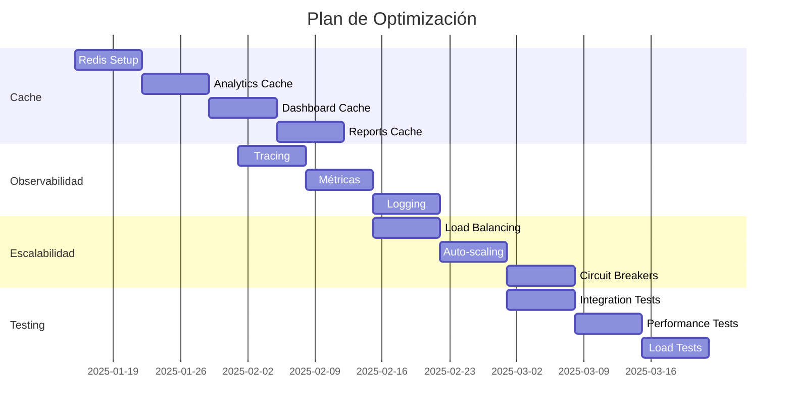

# 🚀 **PLAN DE OPTIMIZACIÓN DE ARQUITECTURA ACTUAL**
*Documento actualizado: 
## 📋 **RESUMEN EJECUTIVO**

Después de un análisis detallado de la arquitectura actual, se ha determinado que la separación en microservicios es óptima. Este documento detalla el plan de optimización para mejorar el rendimiento y la escalabilidad sin modificar la arquitectura base.

## 🎯 **OBJETIVOS**

1. Optimizar performance
2. Mejorar observabilidad
3. Aumentar escalabilidad
4. Fortalecer testing

## 🗺️ **PLAN DE IMPLEMENTACIÓN**

### 1️⃣ **FASE 1: CACHE DISTRIBUIDO** (2 semanas)

#### 1.1 Configuración Redis
```go
// Implementar RedisConfig en infrastructure/cache/config.go
type RedisConfig struct {
    Host     string
    Port     int
    Password string
    DB       int
    TTL      time.Duration
}
```

#### 1.2 Cache para Analytics
```go
// Implementar en infrastructure/cache/analytics_cache.go
type AnalyticsCache interface {
    GetExpensesSummary(ctx context.Context, userID string, period DatePeriod) (*ExpensesSummary, error)
    SetExpensesSummary(ctx context.Context, userID string, period DatePeriod, summary *ExpensesSummary) error
    GetCategoriesAnalytics(ctx context.Context, userID string) (*CategoriesAnalytics, error)
    SetCategoriesAnalytics(ctx context.Context, userID string, analytics *CategoriesAnalytics) error
}
```

#### 1.3 Cache para Dashboard
```go
// Implementar en infrastructure/cache/dashboard_cache.go
type DashboardCache interface {
    GetDashboardOverview(ctx context.Context, userID string) (*DashboardOverview, error)
    SetDashboardOverview(ctx context.Context, userID string, overview *DashboardOverview) error
    InvalidateUserCache(ctx context.Context, userID string) error
}
```

#### 1.4 Cache para Reportes
```go
// Implementar en infrastructure/cache/reports_cache.go
type ReportsCache interface {
    GetMonthlyReport(ctx context.Context, userID string, month time.Time) (*MonthlyReport, error)
    SetMonthlyReport(ctx context.Context, userID string, month time.Time, report *MonthlyReport) error
    GetYearlyReport(ctx context.Context, userID string, year int) (*YearlyReport, error)
    SetYearlyReport(ctx context.Context, userID string, year int, report *YearlyReport) error
}
```

#### 1.5 Integración del Cache (Patrón Decorator)
```go
// Envolver los servicios existentes con una capa de cache.
// Ejemplo para el DashboardUseCase en /internal/core/usecases/dashboard_cached.go

type DashboardUseCaseWithCache struct {
	decorated DashboardUseCase
	cache     DashboardCache
}

func NewDashboardUseCaseWithCache(decorated DashboardUseCase, cache DashboardCache) DashboardUseCase {
	return &DashboardUseCaseWithCache{
		decorated: decorated,
		cache:     cache,
	}
}

func (uc *DashboardUseCaseWithCache) GetDashboardOverview(ctx context.Context, params DashboardParams) (*DashboardOverview, error) {
	// 1. Intentar obtener del cache
	cachedOverview, err := uc.cache.GetDashboardOverview(ctx, params.UserID)
	if err == nil && cachedOverview != nil {
		return cachedOverview, nil // Cache hit
	}

	// 2. Si no está en cache, llamar al servicio original
	overview, err := uc.decorated.GetDashboardOverview(ctx, params)
	if err != nil {
		return nil, err
	}

	// 3. Guardar el resultado en cache para futuras peticiones
	_ = uc.cache.SetDashboardOverview(ctx, params.UserID, overview)

	return overview, nil
}
```

### 2️⃣ **FASE 2: OBSERVABILIDAD** (3 semanas)

#### 2.1 Tracing Distribuido
```go
// Implementar en infrastructure/tracing/tracer.go
import "go.opentelemetry.io/otel/sdk/trace"
import "go.opentelemetry.io/otel/exporters/jaeger" // o el exporter deseado

type Tracer interface {
    StartSpan(ctx context.Context, name string) (context.Context, Span)
    InjectHTTPHeaders(ctx context.Context, headers http.Header)
    ExtractHTTPHeaders(headers http.Header) context.Context
}

// Configuración OpenTelemetry
func initTracer(url string) (*trace.TracerProvider, error) {
    exporter, err := jaeger.New(jaeger.WithCollectorEndpoint(jaeger.WithEndpoint(url)))
    if err != nil {
        return nil, err
    }
    return trace.NewTracerProvider(
        trace.WithSampler(trace.AlwaysSample()),
        trace.WithBatcher(exporter),
    ), nil
}
```

#### 2.2 Métricas Detalladas
```go
// Implementar en infrastructure/metrics/collector.go
type MetricsCollector interface {
    RecordLatency(name string, duration time.Duration)
    IncrementCounter(name string, labels map[string]string)
    RecordGauge(name string, value float64)
    RecordHistogram(name string, value float64)
}

// Métricas a implementar:
- request_duration_seconds
- request_total
- errors_total
- cache_hit_ratio
- active_users
- transaction_amount_total
```

#### 2.3 Logging Estructurado
```go
// Mejorar en infrastructure/logger/logger.go
type Logger interface {
    Info(msg string, fields ...Field)
    Error(msg string, fields ...Field)
    Debug(msg string, fields ...Field)
    WithContext(ctx context.Context) Logger
    WithTraceID(traceID string) Logger
    WithUserID(userID string) Logger
}
```

#### 2.4 Integración de Observabilidad (Middleware)
```go
// Crear un middleware de Gin en /internal/infrastructure/http/middleware/observability.go
func ObservabilityMiddleware(tracer Tracer, metrics MetricsCollector) gin.HandlerFunc {
	return func(c *gin.Context) {
		// Extraer trace del header
		ctx := tracer.ExtractHTTPHeaders(c.Request.Header)
		
		// Iniciar un nuevo span
		ctx, span := tracer.StartSpan(ctx, c.Request.URL.Path)
		defer span.End()

		// Inyectar traceID en el logger
		// ...

		start := time.Now()
		c.Next() // Procesar la petición
		duration := time.Since(start)

		// Registrar métricas
		labels := map[string]string{"method": c.Request.Method, "path": c.FullPath(), "status": strconv.Itoa(c.Writer.Status())}
		metrics.IncrementCounter("request_total", labels)
		metrics.RecordLatency("request_duration_seconds", duration)
	}
}
```

### 3️⃣ **FASE 3: ESCALABILIDAD** (2 semanas)

#### 3.1 Load Balancing
```yaml
# Configuración en k8s/base/ingress.yaml
apiVersion: networking.k8s.io/v1
kind: Ingress
metadata:
  annotations:
    nginx.ingress.kubernetes.io/rewrite-target: /
    nginx.ingress.kubernetes.io/ssl-redirect: "true"
spec:
  rules:
  - http:
      paths:
      - path: /api/v1
        pathType: Prefix
        backend:
          service:
            name: financial-resume-engine
            port:
              number: 8080
```

#### 3.2 Auto-scaling
```yaml
# Configuración en k8s/base/hpa.yaml
apiVersion: autoscaling/v2
kind: HorizontalPodAutoscaler
metadata:
  name: financial-resume-engine
spec:
  scaleTargetRef:
    apiVersion: apps/v1
    kind: Deployment
    name: financial-resume-engine
  minReplicas: 2
  maxReplicas: 10
  metrics:
  - type: Resource
    resource:
      name: cpu
      target:
        type: Utilization
        averageUtilization: 70
```

#### 3.3 Circuit Breakers
```go
// Implementar en infrastructure/resilience/circuit_breaker.go
import "github.com/sony/gobreaker"
import "log"

type CircuitBreaker interface {
    Execute(ctx context.Context, command func() error) error
    GetState() State
    GetMetrics() Metrics
}

// Configuración:
breaker := gobreaker.NewCircuitBreaker(gobreaker.Settings{
    Name:          "financial-api-external",
    MaxRequests:   100,
    Interval:      10 * time.Second,
    Timeout:       60 * time.Second,
    OnStateChange: func(name string, from gobreaker.State, to gobreaker.State) {
		log.Printf("CircuitBreaker '%s' changed from '%s' to '%s'", name, from, to)
	},
})
```

#### 3.4 Integración de Circuit Breaker
```go
// Envolver las llamadas a servicios externos en los proxies.
// Ejemplo en /internal/infrastructure/proxy/ai_service_proxy.go

type AIServiceProxy struct {
    httpClient *http.Client
    breaker    *gobreaker.CircuitBreaker
}

func (p *AIServiceProxy) GetAIInsights(ctx context.Context, params InsightsParams) (*AIResponse, error) {
    var response *AIResponse
    var err error

    _, err = p.breaker.Execute(func() (interface{}, error) {
        // Lógica de la llamada HTTP al servicio de IA
        // ...
        return response, err
    })

    if err != nil {
        return nil, err
    }
    return response, nil
}
```

### 4️⃣ **FASE 4: TESTING** (3 semanas)

#### 4.1 Tests de Integración
```go
// Implementar en test/integration/suite.go
type IntegrationTestSuite struct {
    suite.Suite
    ctx          context.Context
    db           *sql.DB
    redisClient  *redis.Client
    httpClient   *http.Client
    mockServices *MockServices
}

// Tests a implementar:
// Escenario 1: Flujo de usuario feliz
// - Usuario se registra -> Log in -> Crea una categoría -> Crea un presupuesto ->
//   Añade un gasto por debajo del presupuesto -> Verifica el dashboard.
// Escenario 2: Flujo de presupuesto excedido
// - Usuario crea un gasto que excede el presupuesto -> Verifica el estado "exceeded" ->
//   (Opcional) Verifica que se envía una notificación.
// Escenario 3: Interacción con Gamificación
// - Usuario completa una acción (ej. crear gasto) -> Verifica que se llama al GamificationService ->
//   Verifica que los puntos de experiencia (XP) se actualizan.
// Escenario 4: Cache
// - Solicita el dashboard -> Verifica que la segunda petición es más rápida (cache hit) ->
//   Crea una transacción -> Invalida el cache -> Verifica que la siguiente petición al dashboard es lenta de nuevo.
```

#### 4.2 Tests de Performance
```go
// Implementar en test/performance/benchmarks.go
func BenchmarkAPIEndpoints(b *testing.B) {
    benchmarks := []struct {
        name    string
        endpoint string
        method  string
        payload interface{}
    }{
        {"GetDashboard", "/api/v1/dashboard", "GET", nil},
        {"CreateExpense", "/api/v1/expenses", "POST", expense},
        {"ListTransactions", "/api/v1/transactions", "GET", nil},
    }
    // ...
}
```

#### 4.3 Tests de Carga
```yaml
# k6 test en test/load/scenarios.js
export const options = {
  scenarios: {
    normal_load: {
      executor: 'ramping-vus',
      startVUs: 0,
      stages: [
        { duration: '2m', target: 100 },
        { duration: '5m', target: 100 },
        { duration: '2m', target: 0 },
      ],
    },
    stress_test: {
      executor: 'ramping-vus',
      startVUs: 0,
      stages: [
        { duration: '2m', target: 200 },
        { duration: '5m', target: 200 },
        { duration: '2m', target: 0 },
      ],
    },
  },
}
```

## 📊 **MÉTRICAS DE ÉXITO**

1. **Performance**
- Latencia p95 < 200ms
- Cache hit ratio > 85%
- Error rate < 0.1%

2. **Escalabilidad**
- Zero-downtime deployments
- Auto-scaling response < 30s
- Circuit breaker recovery < 5s

3. **Testing**
- Code coverage > 80%
- Integration tests coverage > 70%
- Load test success rate > 99.9%

## ⏱️ **TIMELINE**



## 🚀 **PRÓXIMOS PASOS**

1. Revisión y aprobación del plan
2. Asignación de recursos
3. Setup de ambientes
4. Inicio de Fase 1

## 📝 **NOTAS PARA AGENTES IA**

1. **Prioridad de Implementación**
- Seguir el orden de las fases.
- Cache es crítico para performance.
- Observabilidad necesaria para debugging.

2. **Consideraciones de Código**
- **Usar el Patrón Decorator para el cache**: No modificar los servicios existentes. Crear un nuevo struct que envuelva el servicio y añada la lógica de cache.
- **Integrar observabilidad vía Middleware**: Aplicar el middleware de observabilidad a nivel de router para cubrir todos los endpoints.
- **Aplicar Circuit Breakers en los Proxies**: Envolver las llamadas HTTP a servicios externos (IA, Gamificación) dentro de los circuit breakers.
- Mantener Clean Architecture y principios SOLID.
- Documentar cada componente nuevo.

3. **Testing**
- Escribir tests para los nuevos decoradores y middlewares.
- Implementar los escenarios de integración detallados.
- Automatizar pruebas de carga en el pipeline de CI/CD.

4. **Monitoreo**
- Implementar alerting para las métricas clave (ej. error rate > 1%, latencia > 500ms).
- Configurar dashboards en Grafana (o similar) para visualizar métricas y traces.
- Establecer baselines de performance después de cada fase.

---

*Estado: READY FOR IMPLEMENTATION* 🚀
*Arquitectura: OPTIMIZATION FOCUSED* ⚡
*Testing: COMPREHENSIVE APPROACH* 🧪
*Documentación: DETALLADA Y ACTUALIZADA* 📚 