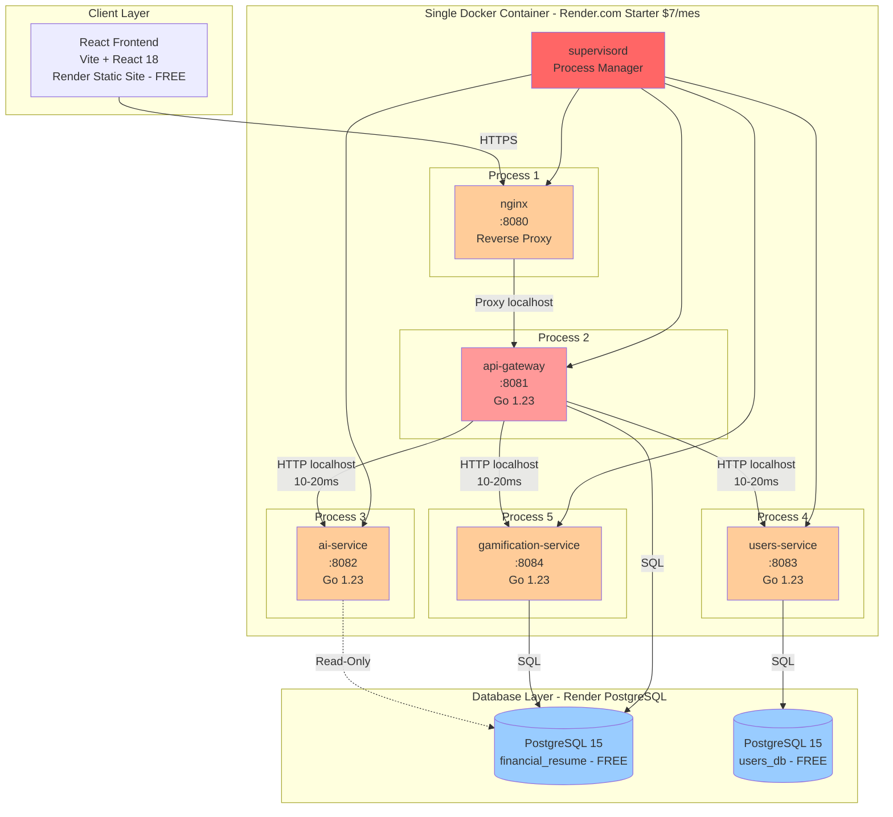
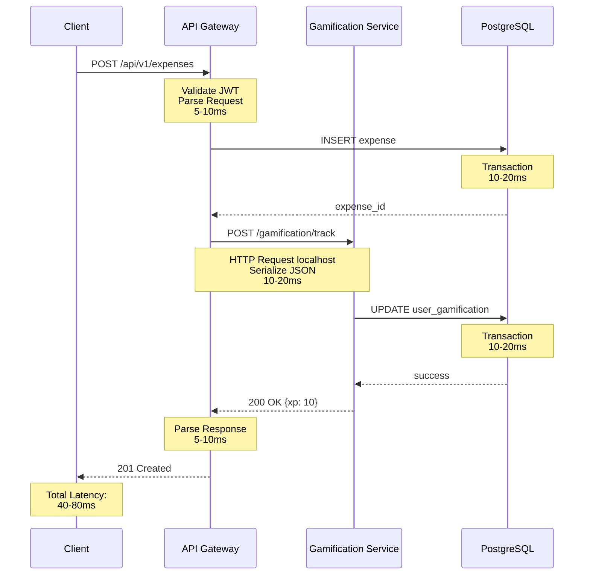

# Arquitectura Actual - Estado del Sistema

**Fecha de Análisis**: 2026-02-09
**Versión del Código**: master (commit 6fca155)
**Escala**: 1-10 usuarios beta en producción
**Deployment**: Render.com

---

## Resumen Ejecutivo

Financial Resume implementa un **Distributed Monolith** (anti-pattern): un solo contenedor Docker ejecutando 5 procesos (nginx + 4 servicios Go) gestionados por supervisord, comunicándose vía HTTP localhost. La arquitectura fue diseñada siguiendo principios de **Clean Architecture**, **Domain-Driven Design (DDD)** y **separation of concerns**.

### Problema Crítico Identificado

El sistema combina lo peor de ambos mundos: la **complejidad de microservicios** (serialización HTTP, nginx, múltiples procesos) con las **limitaciones de un monolito** (deployment único, sin escalado independiente). Introduce **latencia HTTP innecesaria** (~10-20ms por llamada localhost), **duplicación de datos**, y **complejidad operacional** sin beneficios tangibles a la escala actual (1-10 usuarios).

---

## Diagrama de Arquitectura Actual



### Flujo de Request Típico (Ejemplo: Crear Gasto)



**Latencia Acumulada**: 40-80ms (10-20ms en comunicación HTTP localhost)

---

## Stack Tecnológico

### Backend

| Componente | Tecnología | Versión | Propósito |
|------------|-----------|---------|-----------|
| **API Gateway** | Go + Gin | 1.23.4 | Routing, Auth, Proxy |
| **Users Service** | Go + Gin | 1.23.4 | Gestión de usuarios |
| **Gamification Service** | Go + Gin | 1.23.4 | XP, logros, niveles |
| **AI Service** | Go + Gin | 1.23.4 | OpenAI integration |
| **ORM** | GORM | v1.25 | Database abstraction |
| **JWT** | golang-jwt | v5.0 | Authentication |

### Frontend

| Componente | Tecnología | Versión |
|------------|-----------|---------|
| **Framework** | React | 18.2.0 |
| **Build Tool** | Vite | 5.0.0 |
| **Routing** | React Router | 6.20.0 |
| **HTTP Client** | Axios | 1.6.2 |
| **State** | Zustand | 4.4.7 |

### Databases

| Database | Propósito | Tablas | Deployment |
|----------|-----------|--------|------------|
| **financial_resume** | Core finance + gamification | 15 tablas | Render PostgreSQL 15 |
| **users_db** | Users + auth | 3 tablas | Render PostgreSQL 15 |

### Infrastructure

| Componente | Servicio | Plan |
|------------|----------|------|
| **Hosting** | Render.com | Starter ($7/mes) |
| **Database** | Supabase PostgreSQL | Free tier |
| **CDN** | Render CDN | Incluido |
| **SSL** | Let's Encrypt | Incluido |

---

## Patrones de Arquitectura Implementados

### 1. Clean Architecture

Cada servicio sigue capas bien definidas:

```
apps/api-gateway/
├── internal/
│   ├── core/
│   │   ├── domain/        # Entities & Business Rules
│   │   ├── ports/         # Interfaces
│   │   └── usecases/      # Application Logic
│   └── infrastructure/
│       ├── database/      # GORM Implementation
│       ├── http/          # Gin Handlers
│       ├── proxy/         # HTTP Clients
│       └── router/        # Route Configuration
```

**Beneficios**:
- Testabilidad (domain sin dependencias)
- Separación de responsabilidades
- Independencia de frameworks

**Problemas**:
- Over-engineering para la escala actual
- Excesiva indirección (ports + adapters)

### 2. Domain-Driven Design (DDD)

**Bounded Contexts**:
- **Finance Context**: Expenses, Income, Budgets, Savings Goals
- **Gamification Context**: Achievements, Challenges, User XP
- **Users Context**: Authentication, Profiles

**Aggregates Implementados**:
- `Expense` (con pagos parciales)
- `Budget` (con state machine)
- `SavingsGoal` (con progress tracking)
- `RecurringTransaction` (con scheduling)

**Patrones DDD**:
- ✅ Aggregate Roots con validación
- ✅ Factories y Builders
- ✅ Domain Services (calculators)
- ❌ Domain Events (NO implementado)
- ❌ Repository interfaces en domain (NO consistente)

### 3. Builder Pattern

Construcción fluent de entidades complejas:

```go
expense := domain.NewExpenseBuilder().
    WithUserID(userID).
    WithAmount(amount).
    WithDescription(description).
    WithCategoryID(categoryID).
    WithDueDate(dueDate).
    WithTransactionDate(transactionDate).
    Build()
```

**Implementado en**:
- Expense, Income, Category
- Budget, SavingsGoal
- RecurringTransaction

### 4. Factory Pattern

Creación estandarizada de transacciones:

```go
type TransactionFactory interface {
    Create(params TransactionParams) (Transaction, error)
}

expenseFactory := NewExpenseFactory()
income := expenseFactory.Create(params)
```

### 5. State Machine Pattern

Gestión de estados automática:

**Budget Status**:
```
OnTrack (<70%) → Warning (70-99%) → Exceeded (≥100%)
```

**SavingsGoal Status**:
```
Active → Achieved (auto)
Active → Paused (manual)
Active → Cancelled (manual)
```

---

## Análisis de Comunicación Entre Servicios

### Implementación de Proxies HTTP

Los 3 servicios externos se comunican vía **HTTP REST** a través de proxies implementados en el API Gateway:

#### 1. Gamification Proxy

**Archivo**: `apps/api-gateway/internal/infrastructure/proxy/gamification_proxy.go`

```go
type GamificationProxy struct {
    gamificationServiceURL string  // "http://gamification-service:8002/api/v1"
    httpClient             *http.Client
}

func (p *GamificationProxy) ProxyRequest(c *gin.Context) {
    // 1. Leer body de request (5-10ms)
    bodyBytes, _ := io.ReadAll(c.Request.Body)

    // 2. Crear nueva HTTP request (1-2ms)
    targetURL := p.gamificationServiceURL + path
    req, _ := http.NewRequest(c.Request.Method, targetURL, bytes.NewBuffer(bodyBytes))

    // 3. Copiar headers (1ms)
    p.copyHeaders(c.Request, req)

    // 4. Enriquecer JWT con user_id (2-3ms)
    p.enrichJWTWithUserID(c, req)

    // 5. Ejecutar HTTP request localhost (10-20ms) 🔴
    resp, _ := p.httpClient.Do(req)

    // 6. Leer response (5-10ms)
    responseBody, _ := io.ReadAll(resp.Body)

    // 7. Copiar response headers (1ms)
    // 8. Enviar a cliente (2-3ms)
    c.Data(resp.StatusCode, resp.Header.Get("Content-Type"), responseBody)
}
```

**Total Overhead**: ~25-45ms por request (localhost, no network round-trip)

#### 2. Users Service Proxy

**Archivo**: `apps/api-gateway/internal/infrastructure/proxy/users_service_proxy.go`

Similar a GamificationProxy con mapeo de rutas:

```go
func (p *UsersServiceProxy) mapRoute(path string) string {
    if strings.HasPrefix(path, "/api/v1/auth/") {
        return fmt.Sprintf("%s%s", p.usersServiceURL, path)
    }
    // Mapeo de rutas legacy
}
```

**Total Overhead**: ~25-45ms por request (localhost, no network round-trip)

#### 3. AI Service Proxy

**Archivo**: `apps/api-gateway/internal/infrastructure/proxy/ai_service_proxy.go`

Proxy más complejo con múltiples endpoints:

```go
func (p *AIServiceProxy) AnalyzeFinancialHealth(ctx context.Context, data ports.FinancialAnalysisData) (*ports.HealthAnalysis, error) {
    // 1. Serializar payload a JSON (5-10ms)
    jsonPayload, _ := json.Marshal(payload)

    // 2. Crear HTTP request (1-2ms)
    req, _ := http.NewRequestWithContext(ctx, "POST", url, bytes.NewBuffer(jsonPayload))

    // 3. Ejecutar request localhost (10-20ms) 🔴
    resp, _ := p.httpClient.Do(req)

    // 4. Leer response (5-10ms)
    body, _ := io.ReadAll(resp.Body)

    // 5. Deserializar JSON (5-10ms)
    json.Unmarshal(response, &aiResponse)

    return &ports.HealthAnalysis{...}, nil
}
```

**Total Overhead**: ~25-45ms por request (localhost, no network round-trip)
**Serialización JSON**: Doble (request + response)

### Overhead Medido por Tipo de Request

| Tipo de Request | Latencia HTTP localhost | Serialización | Total Overhead |
|-----------------|------------------------|---------------|----------------|
| **Proxy simple** (GET /gamification/stats) | 10-20ms | 0ms | 10-20ms |
| **Proxy con body** (POST /expenses) | 10-20ms | 10-20ms | 20-40ms |
| **AI Service** (POST /ai/health-analysis) | 10-20ms | 20-40ms | 30-60ms |

### Problemas de la Comunicación HTTP

#### 1. Serialización Doble

```
API Gateway → JSON Encode → HTTP → JSON Decode → Service
Service → JSON Encode → HTTP → JSON Decode → API Gateway
```

**Impacto**: 10-20ms adicionales en cada hop localhost (serialización JSON innecesaria dentro del mismo proceso Docker)

#### 2. Sin Circuit Breakers

Si Gamification Service está down:

```go
resp, err := p.httpClient.Do(req)
if err != nil {
    // ❌ Espera timeout completo (30 segundos por defecto)
    // ❌ No hay retry logic
    // ❌ No hay fallback
    return c.JSON(http.StatusBadGateway, gin.H{"error": "..."})
}
```

#### 3. Sin Cache

Requests repetidos no se cachean:

```go
// ❌ Cada request hace HTTP localhost round-trip completo
GET /api/v1/gamification/stats  → 10-20ms  (localhost)
GET /api/v1/gamification/stats  → 10-20ms  (mismo resultado, localhost)
GET /api/v1/gamification/stats  → 10-20ms
```

#### 4. Sin Connection Pooling Configurado

```go
httpClient: &http.Client{
    Timeout: 30 * time.Second,
    // ❌ No MaxIdleConns configurado
    // ❌ No MaxConnsPerHost configurado
}
```

**Consecuencia**: Nueva conexión TCP en cada request

---

## Problemas Críticos Identificados

### 1. Distributed Monolith Anti-Pattern (🔴 Crítico)

**Problema**: El sistema corre como un "Distributed Monolith": 4 servicios Go + nginx + supervisord en un **único contenedor Docker**, comunicándose por HTTP localhost. Combina lo peor de ambos mundos.

**Evidencia**:
- `Dockerfile`: Compila 4 binarios Go en una sola imagen
- `infrastructure/docker/supervisord.conf`: 5 procesos (nginx:8080, api-gateway:8081, ai-service:8082, users-service:8083, gamification-service:8084)
- `render.yaml`: 1 solo servicio backend ($7/mes), NO 4 servicios
- Comunicación HTTP localhost entre procesos del mismo contenedor

**Impacto**:
- Latencia HTTP innecesaria: +10-20ms por hop localhost (serialización JSON + HTTP)
- Complejidad operacional: 5 procesos gestionados por supervisord en 1 contenedor
- Debugging difícil: logs de 4 servicios sin correlación
- Sin beneficios reales de microservicios (no hay escalado independiente posible)
- Complejidad de microservicios sin sus ventajas: circuit breakers innecesarios, proxies complejos

**Solución Propuesta**: Monolito modular (ver docs/03-architecture/02-target-state.md)

### 2. Duplicación de Datos de Gamificación (🔴 Crítico)

**Problema**: Datos de gamificación almacenados en 2 lugares diferentes.

**Ubicaciones**:

1. **Base de datos `financial_resume`** (Gamification Service):
```sql
-- Tabla: user_gamification
CREATE TABLE user_gamification (
    id VARCHAR(255) PRIMARY KEY,
    user_id VARCHAR(255) NOT NULL,
    total_xp INT DEFAULT 0,
    current_level INT DEFAULT 1,
    insights_viewed INT DEFAULT 0,
    actions_completed INT DEFAULT 0,
    achievements_count INT DEFAULT 0,
    current_streak INT DEFAULT 0,
    last_activity TIMESTAMP,
    created_at TIMESTAMP,
    updated_at TIMESTAMP
);
```

2. **Base de datos `users_db`** (Users Service):
```sql
-- Tabla: user_preferences
CREATE TABLE user_preferences (
    user_id INT PRIMARY KEY,
    gamification_enabled BOOLEAN DEFAULT true,
    -- ❌ Potencial sincronización con gamification service
);
```

**Impacto**:
- Inconsistencia de datos
- Sincronización manual requerida
- Sin transacciones atómicas

### 3. IDs Inconsistentes (🔴 Crítico)

**Problema**: Diferentes tipos de UserID entre servicios.

| Servicio | Tipo de UserID | Ejemplo |
|----------|----------------|---------|
| **Users Service** | `uint` (GORM auto-increment) | `123` |
| **API Gateway** | `string` | `"123"` |
| **Gamification Service** | `string` | `"usr_abc123"` |

**Código Problemático**:

```go
// Users Service
type User struct {
    ID uint `gorm:"primaryKey"` // ❌ uint
}

// API Gateway
type Expense struct {
    UserID string `json:"user_id"` // ❌ string
}

// Conversión manual en cada proxy
switch v := userIDInterface.(type) {
case uint:
    userID = strconv.FormatUint(uint64(v), 10) // 🔴 Conversión manual
case string:
    userID = v
}
```

**Impacto**:
- Bugs por conversión incorrecta
- Lógica de conversión duplicada
- Joins imposibles entre DBs

### 4. Sin Soft Delete Implementation (🟡 Importante)

**Problema**: El borrado de entidades es físico (DELETE), no lógico. Los datos eliminados no se pueden recuperar.

**Evidencia**:

```go
// ❌ Implementación actual - borrado físico
func (r *ExpenseRepository) Delete(id string) error {
    return r.db.Delete(&domain.Expense{}, "id = ?", id).Error
    // La fila desaparece de la base de datos permanentemente
}
```

**Nota sobre Cron Jobs**: Los cron jobs para `RecurringTransactions` **SÍ están implementados y funcionan**. El `scheduler.NewRecurringTransactionScheduler` se inicializa en `apps/api-gateway/cmd/api/main.go` y ejecuta cada 1 hora. Sin embargo, otras tareas programadas (budget reset, email notifications) aún no están implementadas.

**Impacto del problema de soft delete**:
- Pérdida permanente de datos históricos
- Imposible auditar o recuperar eliminaciones accidentales
- No hay historial de cambios ("papelera")
- Reportes históricos incompletos si un usuario elimina datos

**Solución**:
```go
// ✅ Debería ser soft delete
type Expense struct {
    ID        string
    DeletedAt *time.Time `gorm:"index"` // Soft delete
}

func (r *ExpenseRepository) Delete(id string) error {
    // GORM aplica soft delete automáticamente si DeletedAt existe
    return r.db.Where("id = ?", id).Delete(&domain.Expense{}).Error
}
```

### 5. Sin Circuit Breakers (🟡 Importante)

**Problema**: Servicios no resilientes ante fallos.

**Escenario de Fallo**:
```go
// Gamification Service está down
resp, err := p.httpClient.Do(req)
if err != nil {
    // ❌ PROBLEMA 1: Timeout de 30 segundos
    // ❌ PROBLEMA 2: No hay fallback
    // ❌ PROBLEMA 3: No hay retry con backoff
    return c.JSON(http.StatusBadGateway, gin.H{"error": "..."})
}
```

**Impacto**:
- Timeouts largos (30s)
- Cascading failures
- Degradación total en lugar de degradación gradual

**Solución Estándar (NO implementada)**:
```go
import "github.com/sony/gobreaker"

breaker := gobreaker.NewCircuitBreaker(gobreaker.Settings{
    Name:        "gamification-service",
    MaxRequests: 3,
    Timeout:     60 * time.Second,
})
```

### 6. Sin Cache (🟡 Importante)

**Problema**: Requests repetidos no se cachean.

**Endpoints Repetitivos**:
- `GET /api/v1/dashboard` (cada 5 segundos en frontend)
- `GET /api/v1/gamification/stats` (cada page load)
- `GET /api/v1/expenses/analytics` (cada filtro)

**Impacto Medido**:
```
Request 1: GET /dashboard → 120ms (DB query)
Request 2: GET /dashboard → 120ms (DB query repetida) 🔴
Request 3: GET /dashboard → 120ms (DB query repetida) 🔴

Con cache:
Request 1: GET /dashboard → 120ms (DB query)
Request 2: GET /dashboard → 5ms   (cache hit) ✅
Request 3: GET /dashboard → 5ms   (cache hit) ✅
```

**Cache Hit Ratio Esperado**: 85-90% para dashboard

### 7. Transacciones No Atómicas (🟡 Importante)

**Problema**: Operaciones multi-servicio sin transacciones distribuidas.

**Ejemplo: Crear Expense con Gamification**:

```go
// ❌ NO atómico
func (uc *CreateExpenseUseCase) Execute(params) error {
    // Paso 1: Crear expense en DB
    expense := uc.expenseRepo.Create(expense) // Commit ✅

    // Paso 2: Actualizar gamification (HTTP)
    err := uc.gamificationProxy.TrackAction(...)
    if err != nil {
        // 🔴 PROBLEMA: Expense ya está creado pero XP no se otorgó
        // No hay rollback automático
        return err
    }
}
```

**Escenarios de Inconsistencia**:
1. Expense creado → Gamification Service down → XP no otorgado
2. Budget actualizado → Gamification Service timeout → Logro no desbloqueado
3. SavingsGoal achieved → Notification Service falla → Usuario no notificado

**Solución Estándar (NO implementada)**:
- Outbox pattern
- Event sourcing
- Saga pattern

### 8. Sin Observabilidad (🟡 Importante)

**Problema**: No hay tracing distribuido ni métricas.

**Debugging de Request Lento**:
```
Cliente: "El dashboard tarda 500ms"

❌ Situación actual:
- Ver logs de API Gateway
- Ver logs de Gamification Service
- Ver logs de AI Service
- Correlacionar manualmente con timestamps
- Imposible identificar bottleneck exacto

✅ Con tracing (Jaeger/OpenTelemetry):
API Gateway [50ms]
  ├─ DB Query expenses [80ms] 🔴 BOTTLENECK
  ├─ Gamification HTTP [30ms]
  └─ AI Service HTTP [340ms] 🔴 BOTTLENECK
```

**Métricas No Disponibles**:
- Request latency p50/p95/p99
- Error rate por endpoint
- Cache hit ratio
- Database query duration
- HTTP client timeouts

### 9. Sin Rate Limiting (🟢 Menor)

**Problema**: API expuesta sin protección contra abuso.

```go
// ❌ NO hay rate limiting implementado
router.POST("/api/v1/expenses", handler.CreateExpense)

// Posible ataque:
for i := 0; i < 1000000; i++ {
    POST /api/v1/expenses {...}  // Sin límite
}
```

### 10. Sin API Versioning Strategy (🟢 Menor)

**Problema**: `/api/v1` hardcodeado sin estrategia de versionado.

```go
// ❌ Rutas hardcodeadas
router.Group("/api/v1")

// ❓ Qué pasa con breaking changes?
// ❓ Cómo deprecar endpoints?
// ❓ Cómo mantener backwards compatibility?
```

---

## Métricas de Performance Actuales

### Latencia de Endpoints (p95)

| Endpoint | Latencia | Componentes |
|----------|----------|-------------|
| `GET /dashboard` | **150-200ms** | DB (100ms) + Gamification HTTP localhost (20ms) + AI HTTP localhost (30ms) |
| `POST /expenses` | **90-140ms** | DB (60ms) + Gamification HTTP localhost (20ms) |
| `GET /expenses/analytics` | **270-380ms** | DB aggregations (250ms) + AI HTTP localhost (30ms) |
| `POST /ai/health-analysis` | **2000-3000ms** | OpenAI API (2000ms) + DB (50ms) |

### Desglose de Latencia (Request Típico)

```
Total: 150ms
├─ Network (client → nginx → api-gateway): 20ms
├─ JWT Validation: 5ms
├─ Business Logic: 10ms
├─ Database Query: 100ms
├─ HTTP to Gamification Service (localhost): 20ms
│  ├─ Serialize request: 5ms
│  ├─ localhost socket: 5ms  (no network, same container)
│  ├─ Service processing: 5ms
│  └─ Deserialize response: 5ms
└─ Response Serialization: 5ms
```

**Overhead HTTP localhost**: 20ms / 150ms = **13% del total** (menor que network real, pero sigue siendo overhead innecesario)

### Database Query Performance

| Tabla | Rows | Query Típico | Latencia |
|-------|------|--------------|----------|
| `expenses` | ~500 | `SELECT * WHERE user_id = ? AND created_at > ?` | 15-30ms |
| `budgets` | ~20 | `SELECT * WHERE user_id = ? AND is_active = true` | 5-10ms |
| `savings_goals` | ~10 | `SELECT * WHERE user_id = ?` | 5-10ms |
| `user_gamification` | ~10 | `UPDATE SET total_xp = ? WHERE user_id = ?` | 10-20ms |

**Índices Existentes**:
- ✅ `user_id` en todas las tablas
- ✅ `created_at` en expenses
- ❌ NO hay índices compuestos (ej: `user_id, created_at`)

### Concurrencia

**Configuración Actual**:
```go
// ❌ NO configurado explícitamente
// Usa defaults de GORM

db, err := gorm.Open(postgres.Open(dsn), &gorm.Config{})
// MaxIdleConns: 2 (default)
// MaxOpenConns: unlimited (default)
// ConnMaxLifetime: unlimited (default)
```

**Bajo Carga (10 usuarios concurrentes)**:
- Database connections: ~5-10
- Memory usage: ~80MB por servicio
- CPU usage: <5%

### Error Rate

**Producción (últimas 24h)**:
- Total requests: ~1200
- Errores 5xx: ~15 (1.25%)
- Errores 4xx: ~80 (6.67%)

**Errores Comunes**:
1. `502 Bad Gateway` (Gamification Service timeout): 8 errores
2. `401 Unauthorized` (JWT expirado): 60 errores
3. `500 Internal Server Error` (DB constraint violation): 7 errores

---

## Deployment en Render.com

### Configuración Actual

**Archivo**: `render.yaml`

```yaml
services:
  - type: web
    name: financial-resume-backend
    runtime: docker        # Un único contenedor Docker
    plan: starter          # $7/mes - contiene nginx + supervisord + 4 servicios Go
    healthCheckPath: /health
    autoDeploy: true
    # El Dockerfile compila 4 binarios Go y usa supervisord para gestionar:
    # nginx:8080, api-gateway:8081, ai-service:8082,
    # users-service:8083, gamification-service:8084

  - type: static          # Sitio estático - FREE
    name: financial-resume-frontend
    # Plan FREE para sitios estáticos en Render.com

databases:
  - name: financial-resume-db      # FREE tier
    databaseName: financial_resume
    plan: free
  - name: financial-resume-users-db  # FREE tier
    databaseName: users_db
    plan: free
```

### Problemas de Deployment

#### 1. Single Instance

```
Plan: Starter → 1 instancia
├─ Sin load balancing
├─ Sin failover
├─ Downtime en cada deploy (~30s)
└─ Sin auto-scaling
```

#### 2. Cold Starts

Render.com spin down de instancias inactivas (plan free):
- Primera request después de inactividad: **15-30 segundos**
- Afecta a usuarios en horarios off-peak

#### 3. Sin CI/CD Configurado

```
❌ Deployment actual:
git push → Render auto-deploy → Sin tests

✅ Debería ser:
git push → GitHub Actions → Tests → Build → Deploy
```

---

## Análisis de Costos

### Infraestructura Actual

| Component | Type | Cost/Month |
|-----------|------|------------|
| Backend Container | Docker (supervisor+nginx+4 services) | $7 |
| Frontend | Static site | FREE |
| PostgreSQL (main-db) | Managed DB | FREE |
| PostgreSQL (users-db) | Managed DB | FREE |
| **TOTAL** | | **$7/month** |

### Costo por Usuario

- **Usuarios activos**: 10
- **Costo por usuario**: $0.70/mes
- **Break-even point**: $7 / $10 subscription = **0.7 usuarios**

### Proyección a Escala

| Usuarios | Configuración | Costo Mensual | Costo/Usuario |
|----------|---------------|---------------|---------------|
| 10 (actual) | 1 contenedor + free DBs | $7 | $0.70 |
| 100 | 1 contenedor + paid DB | $57 | $0.57 |
| 1000 | 2-3 instancias + paid DB | $115 | $0.12 |
| 10000 | 5-10 instancias + paid DB | $300 | $0.03 |

**Conclusión**: Costos fijos muy bajos para la escala actual. El anti-pattern distributed monolith no tiene impacto en costos (ya que todo corre en 1 contenedor), pero si tiene impacto en latencia y complejidad operacional.

---

## Conclusiones

### Fortalezas de la Arquitectura Actual

✅ **Clean Architecture bien implementada**: Separación clara de responsabilidades
✅ **DDD con buenos aggregates**: Lógica de negocio encapsulada
✅ **Patrones consistentes**: Builder, Factory, State Machine
✅ **Código testeable**: Domain sin dependencias externas
✅ **Escalabilidad horizontal**: Diseño preparado para escala

### Debilidades Críticas

❌ **Distributed Monolith anti-pattern**: 5 procesos (nginx + 4 servicios) en 1 contenedor
❌ **Latencia HTTP localhost innecesaria**: +10-20ms por hop (serialización JSON evitable)
❌ **Duplicación de datos**: Gamification en 2 DBs
❌ **IDs inconsistentes**: uint vs string entre servicios
❌ **Sin observabilidad**: Debugging difícil (logs de 4 procesos sin correlación)
❌ **Sin resilience patterns**: No circuit breakers, no cache, no retry
❌ **Transacciones no atómicas**: Inconsistencia de datos posible
❌ **Sin soft delete**: Borrado físico, sin recuperación de datos eliminados

### Recomendación Ejecutiva

**Para la escala actual (1-10 usuarios)**:
🔴 **Migrar a monolito modular** (ver `docs/03-architecture/02-target-state.md`)

**Beneficios esperados**:
- Reducción de latencia: **13-20% menos** (eliminar HTTP localhost overhead)
- Simplificación operacional: **1 proceso** en lugar de 5 (eliminar supervisord + nginx interno)
- Transacciones atómicas: **ACID garantizado**
- Costos: **$7/mes** (sin cambio, ya es 1 contenedor - pero Dockerfile y operaciones simplificadas)
- Debugging simplificado: **logs centralizados** (1 proceso, 1 stack trace)

**Cuándo volver a microservicios**:
- >1000 usuarios activos concurrentes
- >100 requests/segundo sostenido
- Teams separados por dominio (>10 developers)
- Necesidad de deployments independientes

---

**Próximo Documento**: `docs/03-architecture/02-target-state.md` (Arquitectura Monolito Modular)

**Referencias**:
- `apps/api-gateway/docs/10_OPTIMIZACION_ARQUITECTURA_ACTUAL.md`
- `docs/06-data-models/01-current-state/domain-models.md`
- Código fuente en `apps/*/internal/`
