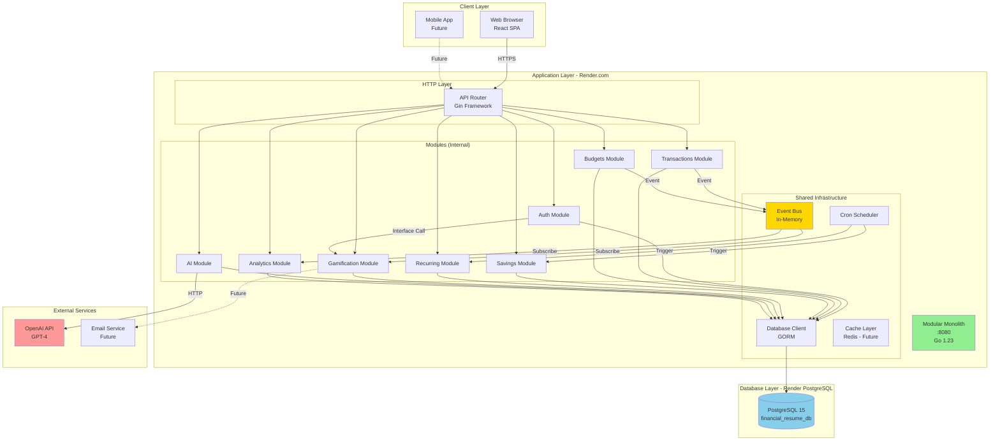
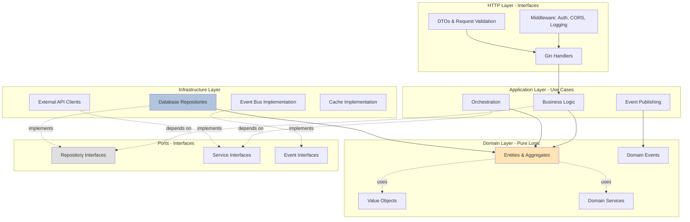
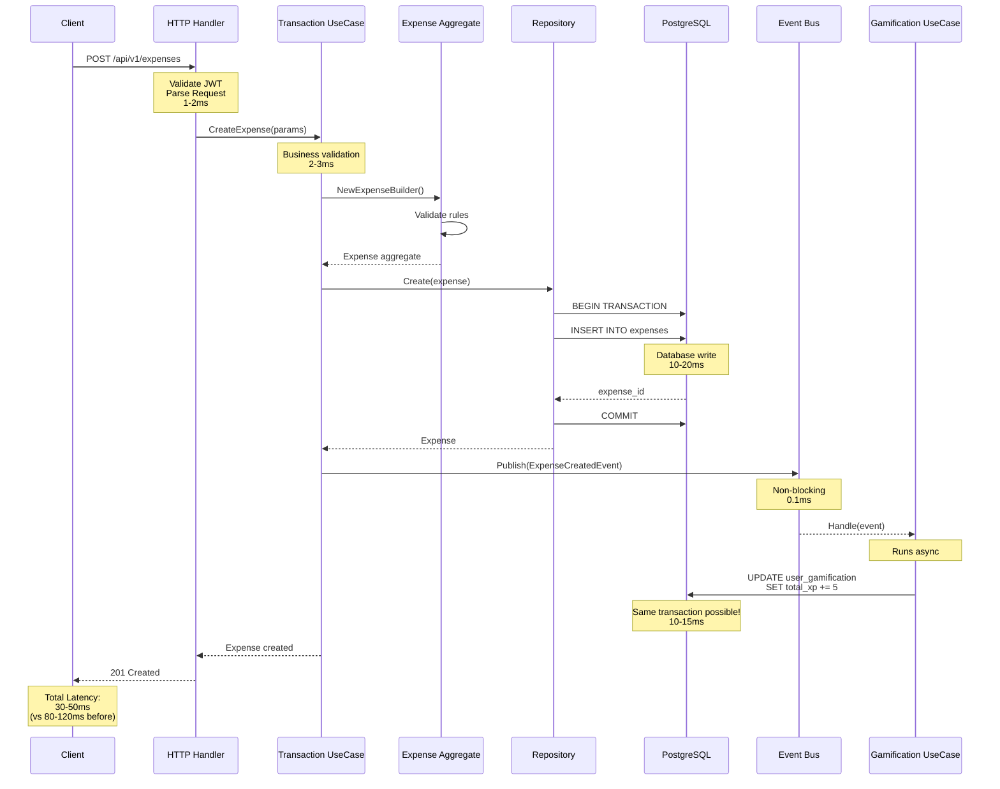
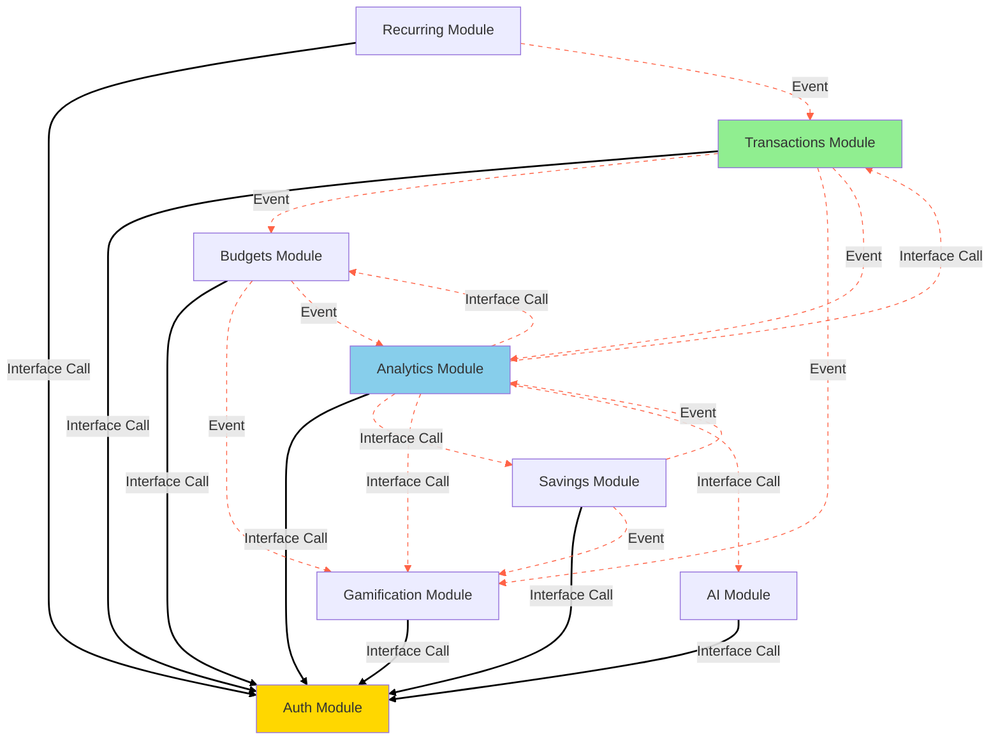
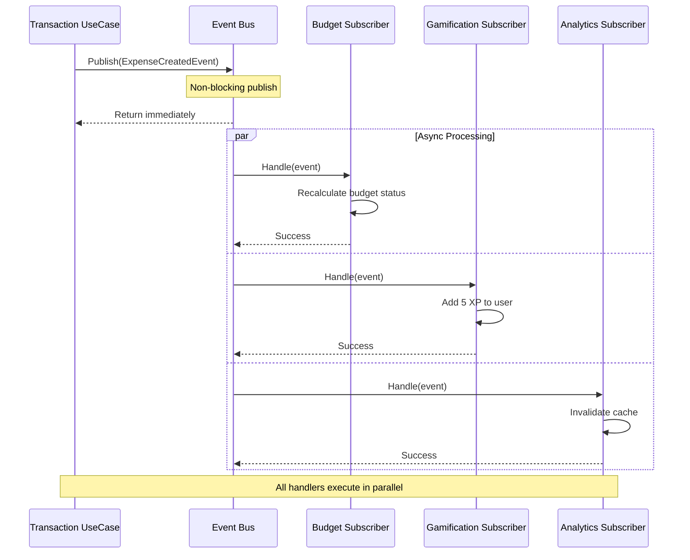
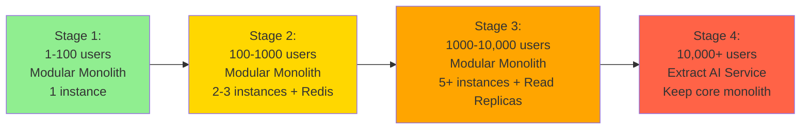
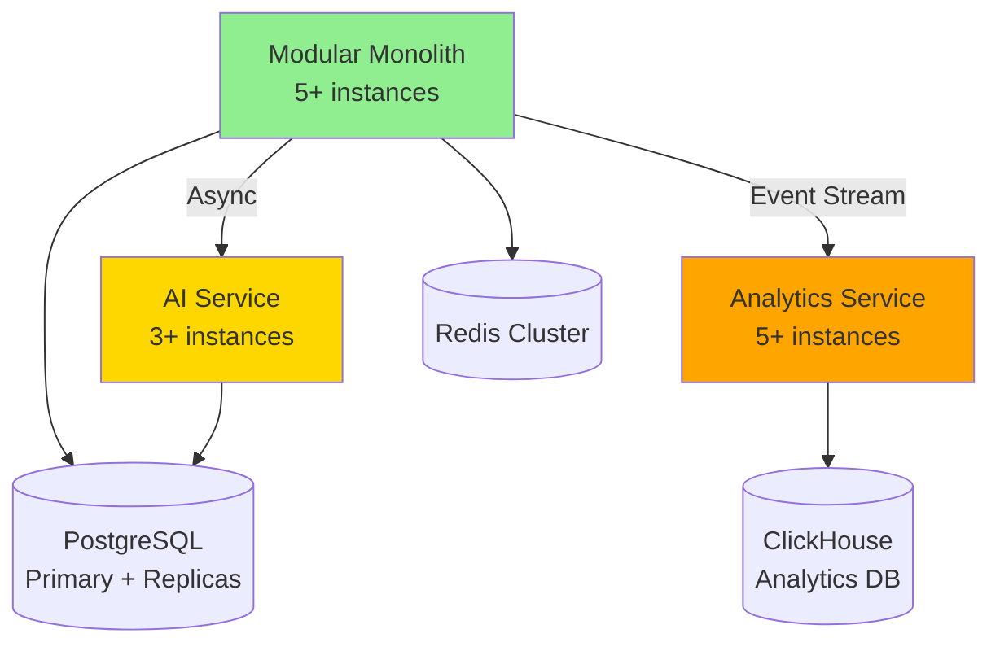

# Target Architecture - Modular Monolith

**Document Version**: 1.0
**Date**: 2026-02-09
**Status**: Proposed
**Target Timeline**: Q1 2026 (3-4 weeks migration)
**Current State**: See [01-current-state.md](./01-current-state.md)

---

## Table of Contents

1. [Executive Summary](#executive-summary)
2. [Vision & Architectural Principles](#vision--architectural-principles)
3. [High-Level Architecture](#high-level-architecture)
4. [System Modules](#system-modules)
5. [Inter-Module Communication](#inter-module-communication)
6. [Event Bus Architecture](#event-bus-architecture)
7. [Technology Stack](#technology-stack)
8. [Database Consolidation](#database-consolidation)
9. [Benefits vs Current State](#benefits-vs-current-state)
10. [Success Criteria](#success-criteria)
11. [Migration Strategy](#migration-strategy)
12. [Future Scalability Path](#future-scalability-path)

---

## Executive Summary

### The Vision

Financial Resume will transition from a **Distributed Monolith** (4 services co-located in 1 Docker container, managed by supervisord, communicating via HTTP localhost) to a **modular monolith** (1 Go binary, 1 database) while **preserving** the strong architectural patterns (Clean Architecture, DDD) that make the codebase maintainable and testable.

### Why This Change?

**Current Pain Points (Distributed Monolith):**
- 🔴 Anti-pattern: 5 processes (nginx + 4 Go binaries) in 1 Docker container managed by supervisord
- 🔴 Latency overhead: +10-20ms per HTTP localhost hop (unnecessary JSON serialization)
- 🔴 Data duplication: Gamification data in 2 databases
- 🔴 Operational complexity: supervisord managing 5 processes, Dockerfile compiling 4 binaries
- 🔴 No ACID transactions: Cross-service operations are eventually consistent
- 🔴 HTTP proxies: Complex JWT enrichment + serialization just to call localhost

**Target State Benefits:**
- ✅ **<100ms p95 latency** (30-40% improvement over current localhost HTTP)
- ✅ **Single process** (eliminate supervisord, nginx, 4 separate binaries)
- ✅ **ACID transactions** (guaranteed consistency)
- ✅ **$7/month** infrastructure cost (same cost, massively reduced complexity)
- ✅ **Zero data duplication**
- ✅ **Unified observability** (single log stream, single stack trace)

### What We're NOT Changing

- ✅ Clean Architecture layering
- ✅ Domain-Driven Design patterns
- ✅ Aggregate roots and value objects
- ✅ API contracts (100% backward compatible)
- ✅ Frontend code (zero changes required)
- ✅ React application architecture

### What We ARE Changing

- 🔄 HTTP localhost inter-service calls → In-memory function calls (eliminate JSON serialization overhead)
- 🔄 2 databases → 1 consolidated database
- 🔄 5 processes (nginx + 4 services) + supervisord → 1 Go binary, no supervisord
- 🔄 4 Dockerfile binaries + nginx config → 1 simple Dockerfile
- 🔄 Eventually consistent → Strongly consistent (ACID)
- 🔄 4 separate log streams → Centralized logging (single process)
- 🔄 Complex HTTP proxies with JWT enrichment → Direct function calls

---

## Vision & Architectural Principles

### Core Principles

#### 1. Modularity Without Distribution

**Philosophy**: "Make it easy to extract a module into a microservice later, but don't do it prematurely."

```go
// Each module is self-contained with clear boundaries
appsinternal/modules/transactions/
├── domain/          // No dependencies on other modules
├── usecases/        // Only depends on domain + ports
├── handlers/        // HTTP layer
└── repository/      // Infrastructure

// Modules communicate ONLY through interfaces (ports)
type BudgetService interface {
    GetBudgetForCategory(ctx context.Context, categoryID string) (*Budget, error)
}
```

#### 2. Event-Driven Architecture (In-Memory)

**Philosophy**: "Decouple modules through events, but keep events in-memory for now."

```go
// Publish events for side effects
eventBus.Publish(ExpenseCreatedEvent{
    UserID:   "usr_123",
    Amount:   100.50,
    Category: "groceries",
})

// Other modules subscribe asynchronously
gamificationModule.On(ExpenseCreatedEvent, func(e Event) {
    AddXP(e.UserID, 5)
})
```

**Migration Path**: When needed, replace in-memory bus with Kafka/RabbitMQ without changing module code.

#### 3. Clean Architecture Preserved

All modules follow the same layering:

```
Outer Layer → Inner Layer (dependency direction ←)

HTTP Handlers → Use Cases → Domain
     ↓              ↓           ↑
Infrastructure  Ports      Pure Logic
   (DB, Cache)  (Interfaces)  (No deps)
```

#### 4. Domain-Driven Design

**Bounded Contexts** (now as modules):
- **Auth Context** → `auth` module
- **Finance Context** → `transactions`, `budgets`, `savings` modules
- **Gamification Context** → `gamification` module
- **AI Context** → `ai` module

**Aggregate Roots** remain unchanged:
- Expense, Income, Budget, SavingsGoal, RecurringTransaction
- User, Achievement, Challenge

#### 5. YAGNI (You Ain't Gonna Need It)

**What we're NOT building yet:**
- ❌ Distributed tracing (Jaeger) - use structured logging
- ❌ Service mesh - not needed for monolith
- ❌ Message queue - in-memory event bus is sufficient
- ❌ API gateway - monolith is the gateway
- ❌ Circuit breakers - no network calls between modules

**We'll add these when:**
- We extract a module into a microservice (then we need tracing, circuit breakers)
- We have >1000 concurrent users (then we need caching, read replicas)
- We have multiple teams (then we need API versioning, service boundaries)

---

## High-Level Architecture

### System Architecture Diagram



### Layered Architecture (Vertical Slice)



### Request Flow Example (Create Expense)



**Key Improvements:**
- ❌ No HTTP serialization/deserialization (saves 10-20ms per localhost hop)
- ✅ ACID transaction across modules (saves data inconsistency)
- ✅ Event bus is in-memory (saves 10-20ms vs HTTP localhost calls)
- ✅ Single database connection pool (no fragmented pools)

---

## System Modules

### Module Structure Template

Each module follows this structure:

```
appsinternal/modules/[module_name]/
├── domain/
│   ├── entities.go          # Aggregate roots, entities
│   ├── value_objects.go     # Value objects
│   ├── services.go          # Domain services
│   ├── events.go            # Domain events
│   └── errors.go            # Domain-specific errors
├── usecases/
│   ├── create_*.go          # Use case implementations
│   ├── update_*.go
│   ├── get_*.go
│   ├── delete_*.go
│   └── contracts.go         # Use case interfaces
├── handlers/
│   ├── http_handlers.go     # Gin handlers
│   ├── dtos.go              # Request/Response DTOs
│   └── routes.go            # Route registration
├── repository/
│   ├── postgres_repository.go   # GORM implementation
│   └── contracts.go             # Repository interfaces
└── module.go                    # Module initialization & DI
```

---

### 1. Auth Module

**Bounded Context**: User authentication, authorization, and profile management.

**Responsibility**:
- User registration, login, JWT issuance
- Password management (hashing, reset)
- User profile CRUD
- Role-based access control (future)

**Structure:**
```
appsinternal/modules/auth/
├── domain/
│   ├── user.go              # User aggregate
│   ├── password.go          # Password value object (hashed)
│   ├── email.go             # Email value object (validated)
│   └── events.go            # UserRegisteredEvent, UserLoggedInEvent
├── usecases/
│   ├── register_user.go     # Registration flow
│   ├── login_user.go        # JWT generation
│   ├── update_profile.go    # Profile management
│   └── contracts.go
├── handlers/
│   ├── auth_handlers.go     # POST /auth/register, /auth/login
│   ├── user_handlers.go     # GET/PUT /users/:id
│   └── routes.go
├── repository/
│   └── user_repository.go   # User persistence
└── module.go
```

**Public Interfaces (Ports):**
```go
// For other modules to validate auth
type AuthService interface {
    ValidateJWT(ctx context.Context, token string) (*UserClaims, error)
    GetUserByID(ctx context.Context, userID string) (*User, error)
    IsUserActive(ctx context.Context, userID string) (bool, error)
}
```

**Domain Events Published:**
- `UserRegisteredEvent` → Triggers gamification welcome bonus
- `UserLoggedInEvent` → Tracks activity streak
- `ProfileUpdatedEvent` → Syncs user data

**Dependencies:**
- **Depends on**: None (foundational module)
- **Used by**: All other modules (for authentication)

**Migration Notes:**
- Merge `users-service` codebase into this module
- Migrate `users_db.users` table → `financial_resume_db.users`
- Migrate `users_db.user_preferences` → `financial_resume_db.user_preferences`
- Standardize `user_id` to `VARCHAR(255)` everywhere

---

### 2. Transactions Module

**Bounded Context**: Expense and income management.

**Responsibility**:
- Create, read, update, delete expenses
- Create, read, update, delete incomes
- Category management
- Transaction date tracking (transaction_date vs created_at)
- Partial payment tracking for expenses

**Structure:**
```
appsinternal/modules/transactions/
├── domain/
│   ├── expense.go           # Expense aggregate
│   ├── income.go            # Income aggregate
│   ├── category.go          # Category entity
│   ├── builders.go          # ExpenseBuilder, IncomeBuilder
│   ├── factory.go           # TransactionFactory
│   └── events.go            # ExpenseCreatedEvent, IncomeCreatedEvent
├── usecases/
│   ├── expenses/
│   │   ├── create.go
│   │   ├── update.go
│   │   ├── delete.go
│   │   ├── list.go
│   │   └── contracts.go
│   ├── incomes/
│   │   ├── create.go
│   │   ├── update.go
│   │   ├── delete.go
│   │   ├── list.go
│   │   └── contracts.go
│   └── categories/
│       ├── manage.go
│       └── contracts.go
├── handlers/
│   ├── expense_handlers.go  # POST/GET/PUT/DELETE /expenses
│   ├── income_handlers.go   # POST/GET/PUT/DELETE /incomes
│   ├── category_handlers.go # GET/POST /categories
│   └── routes.go
├── repository/
│   ├── expense_repository.go
│   ├── income_repository.go
│   └── category_repository.go
└── module.go
```

**Public Interfaces (Ports):**
```go
type TransactionService interface {
    GetTotalExpensesForPeriod(ctx context.Context, userID string, startDate, endDate time.Time) (float64, error)
    GetExpensesByCategory(ctx context.Context, userID, categoryID string) ([]Expense, error)
    GetRecentTransactions(ctx context.Context, userID string, limit int) ([]Transaction, error)
}
```

**Domain Events Published:**
- `ExpenseCreatedEvent` → Triggers budget update, gamification XP
- `ExpenseUpdatedEvent` → Recalculates budget status
- `ExpenseDeletedEvent` → Restores budget, removes XP
- `IncomeCreatedEvent` → Updates savings potential, gamification
- `CategoryCreatedEvent` → Syncs analytics

**Dependencies:**
- **Depends on**: `auth` (to validate user_id)
- **Used by**: `budgets`, `savings`, `analytics`, `gamification`

**Migration Notes:**
- Keep existing code in `api-gateway/internal/usecases/transactions/`
- Add soft delete (`deleted_at TIMESTAMP NULL`)
- Ensure all `user_id` are `VARCHAR(255)`

---

### 3. Budgets Module

**Bounded Context**: Budget planning and tracking.

**Responsibility**:
- Create monthly/weekly budgets per category
- Track spending against budget
- Auto-update status (on_track → warning → exceeded)
- Alert users when budget threshold reached

**Structure:**
```
appsinternal/modules/budgets/
├── domain/
│   ├── budget.go            # Budget aggregate with state machine
│   ├── budget_period.go     # Value object (monthly, weekly, yearly)
│   ├── budget_status.go     # Enum: on_track, warning, exceeded
│   ├── calculator.go        # Domain service for calculations
│   └── events.go            # BudgetExceededEvent, BudgetResetEvent
├── usecases/
│   ├── create_budget.go
│   ├── update_budget.go
│   ├── calculate_status.go  # Triggered by ExpenseCreatedEvent
│   ├── reset_budget.go      # Cron job
│   └── contracts.go
├── handlers/
│   ├── budget_handlers.go   # CRUD operations
│   └── routes.go
├── repository/
│   └── budget_repository.go
└── module.go
```

**Public Interfaces (Ports):**
```go
type BudgetService interface {
    GetBudgetForCategory(ctx context.Context, userID, categoryID string) (*Budget, error)
    IsBudgetExceeded(ctx context.Context, userID, categoryID string) (bool, error)
    GetActiveBudgets(ctx context.Context, userID string) ([]Budget, error)
}
```

**Domain Events Published:**
- `BudgetExceededEvent` → Triggers notification, achievement unlock
- `BudgetWarningEvent` → Sends warning notification
- `BudgetResetEvent` → Occurs on new month/week

**Domain Events Consumed:**
- `ExpenseCreatedEvent` → Recalculates budget status
- `ExpenseUpdatedEvent` → Recalculates budget status
- `ExpenseDeletedEvent` → Restores budget amount

**Dependencies:**
- **Depends on**: `auth`, `transactions` (via events)
- **Used by**: `analytics`

**State Machine:**
```go
// Budget status automatically transitions based on percentage used
type BudgetStatus string

const (
    OnTrack  BudgetStatus = "on_track"   // 0-69% used
    Warning  BudgetStatus = "warning"    // 70-99% used
    Exceeded BudgetStatus = "exceeded"   // ≥100% used
)

func (b *Budget) RecalculateStatus() {
    percentage := (b.CurrentAmount / b.LimitAmount) * 100

    switch {
    case percentage < 70:
        b.Status = OnTrack
    case percentage < 100:
        b.Status = Warning
        b.PublishEvent(BudgetWarningEvent{...})
    default:
        b.Status = Exceeded
        b.PublishEvent(BudgetExceededEvent{...})
    }
}
```

---

### 4. Savings Module

**Bounded Context**: Savings goals and progress tracking.

**Responsibility**:
- Create savings goals with target amount and date
- Track progress toward goals
- Auto-save from income (future)
- Achievement notifications

**Structure:**
```
apps/internal/modules/savings/
├── domain/
│   ├── savings_goal.go      # SavingsGoal aggregate
│   ├── goal_status.go       # active, achieved, paused, cancelled
│   ├── progress_calculator.go   # Domain service
│   └── events.go            # GoalAchievedEvent, ProgressUpdatedEvent
├── usecases/
│   ├── create_goal.go
│   ├── add_contribution.go
│   ├── withdraw.go
│   ├── auto_save.go         # Triggered by IncomeCreatedEvent
│   └── contracts.go
├── handlers/
│   ├── goal_handlers.go
│   └── routes.go
├── repository/
│   └── savings_repository.go
└── module.go
```

**Public Interfaces (Ports):**
```go
type SavingsService interface {
    GetGoalProgress(ctx context.Context, goalID string) (*Progress, error)
    GetActiveGoals(ctx context.Context, userID string) ([]SavingsGoal, error)
    CalculateSavingsPotential(ctx context.Context, userID string) (float64, error)
}
```

**Domain Events Published:**
- `GoalAchievedEvent` → Triggers gamification reward, notification
- `ContributionAddedEvent` → Updates analytics
- `GoalCreatedEvent` → Triggers initial achievement

**Domain Events Consumed:**
- `IncomeCreatedEvent` → Optionally auto-save percentage

**Dependencies:**
- **Depends on**: `auth`, `transactions` (via events)
- **Used by**: `analytics`, `gamification`

---

### 5. Recurring Module

**Bounded Context**: Automated recurring transactions.

**Responsibility**:
- Create recurring expense/income schedules
- Execute scheduled transactions (cron job)
- Handle skipped executions
- Pause/resume recurring transactions

**Structure:**
```
apps/internal/modules/recurring/
├── domain/
│   ├── recurring_transaction.go  # Aggregate with scheduling logic
│   ├── frequency.go              # daily, weekly, monthly, yearly
│   ├── scheduler.go              # Domain service for next execution
│   └── events.go                 # RecurringExecutedEvent
├── usecases/
│   ├── create_recurring.go
│   ├── execute_due.go            # Cron job calls this
│   ├── pause_resume.go
│   └── contracts.go
├── handlers/
│   ├── recurring_handlers.go
│   └── routes.go
├── repository/
│   └── recurring_repository.go
└── module.go
```

**Public Interfaces (Ports):**
```go
type RecurringService interface {
    GetDueTransactions(ctx context.Context, asOfDate time.Time) ([]RecurringTransaction, error)
    ExecuteRecurring(ctx context.Context, recurringID string) error
    GetUpcomingExecutions(ctx context.Context, userID string) ([]Execution, error)
}
```

**Domain Events Published:**
- `RecurringExecutedEvent` → Creates actual expense/income via TransactionModule

**Dependencies:**
- **Depends on**: `auth`, publishes to `transactions` module
- **Used by**: `cron` (infrastructure)

**Cron Job:**
```go
// In infrastructure/cron/scheduler.go
func (s *CronScheduler) ExecuteRecurringTransactions() {
    // Runs daily at 00:00 UTC
    ctx := context.Background()

    dueTransactions := s.recurringService.GetDueTransactions(ctx, time.Now())

    for _, rt := range dueTransactions {
        // Execute in transaction
        s.recurringService.ExecuteRecurring(ctx, rt.ID)
    }
}
```

**Migration Notes:**
- ✅ Cron jobs ARE running in production (`scheduler.NewRecurringTransactionScheduler` initialized in `appsapi-gateway/cmd/api/main.go`, runs every 1 hour)
- Keep cron initialization in monolith's `main.go`
- Consider using `github.com/robfig/cron` for scheduling if more granular control is needed

---

### 6. Gamification Module

**Bounded Context**: XP, levels, achievements, challenges.

**Responsibility**:
- Track user XP and levels
- Unlock achievements based on actions
- Manage challenges and rewards
- Calculate activity streaks

**Structure:**
```
apps/internal/modules/gamification/
├── domain/
│   ├── user_gamification.go     # Aggregate: XP, level, streak
│   ├── achievement.go           # Achievement definitions
│   ├── challenge.go             # Challenge definitions
│   ├── xp_calculator.go         # Domain service
│   └── events.go                # LevelUpEvent, AchievementUnlockedEvent
├── usecases/
│   ├── add_xp.go                # Triggered by events
│   ├── unlock_achievement.go
│   ├── update_streak.go
│   └── contracts.go
├── handlers/
│   ├── gamification_handlers.go # GET /gamification/stats
│   └── routes.go
├── repository/
│   ├── gamification_repository.go
│   └── achievement_repository.go
└── module.go
```

**Public Interfaces (Ports):**
```go
type GamificationService interface {
    GetUserStats(ctx context.Context, userID string) (*UserGamification, error)
    GetAchievements(ctx context.Context, userID string) ([]Achievement, error)
    GetLeaderboard(ctx context.Context, limit int) ([]UserRanking, error)
}
```

**Domain Events Published:**
- `LevelUpEvent` → Triggers notification, badge unlock
- `AchievementUnlockedEvent` → Triggers notification
- `StreakBrokenEvent` → Sends motivational message

**Domain Events Consumed:**
- `ExpenseCreatedEvent` → Add 5 XP
- `IncomeCreatedEvent` → Add 5 XP
- `BudgetCreatedEvent` → Add 10 XP
- `GoalAchievedEvent` → Add 50 XP, unlock achievement
- `UserLoggedInEvent` → Update streak

**Dependencies:**
- **Depends on**: `auth`
- **Used by**: `analytics` (for health score)

**XP Rules:**
```go
// Domain service
type XPCalculator struct{}

func (c *XPCalculator) CalculateXP(action ActionType) int {
    switch action {
    case CreateExpense:
        return 5
    case CreateIncome:
        return 5
    case CreateBudget:
        return 10
    case AchieveSavingsGoal:
        return 50
    case CompleteChallenge:
        return 100
    case MaintainStreak30Days:
        return 200
    default:
        return 0
    }
}
```

**Migration Notes:**
- Merge `gamification-service` into this module
- Consolidate `user_gamification` table (remove duplicates)
- Fix `user_id` type inconsistency

---

### 7. AI Module

**Bounded Context**: OpenAI integration for financial insights.

**Responsibility**:
- Analyze spending patterns
- Generate financial health score
- Provide personalized recommendations
- Detect anomalies

**Structure:**
```
apps/internal/modules/ai/
├── domain/
│   ├── health_analysis.go       # Value object
│   ├── recommendation.go        # Value object
│   └── events.go                # HealthScoreUpdatedEvent
├── usecases/
│   ├── analyze_health.go        # Orchestrates OpenAI call
│   ├── generate_insights.go
│   └── contracts.go
├── handlers/
│   ├── ai_handlers.go           # POST /ai/analyze
│   └── routes.go
├── infrastructure/
│   └── openai_client.go         # OpenAI SDK wrapper
└── module.go
```

**Public Interfaces (Ports):**
```go
type AIService interface {
    AnalyzeFinancialHealth(ctx context.Context, data FinancialData) (*HealthAnalysis, error)
    GenerateRecommendations(ctx context.Context, userID string) ([]Recommendation, error)
}
```

**Domain Events Published:**
- `HealthScoreUpdatedEvent` → Updates dashboard cache

**Dependencies:**
- **Depends on**: `auth`, `transactions`, `budgets`, `savings`
- **External**: OpenAI API (HTTP client)
- **Used by**: `analytics`

**Migration Notes:**
- Keep `ai-service` initially as separate microservice (optional)
- Heavy computation, benefits from isolated scaling
- Later: integrate into monolith if AI calls are fast enough (<500ms)

**Future Optimization:**
- Cache health analysis results (TTL: 1 hour)
- Use background job for expensive analyses
- Implement streaming responses for real-time insights

---

### 8. Analytics Module

**Bounded Context**: Dashboard data, reports, aggregations.

**Responsibility**:
- Generate dashboard data (expenses, budgets, savings, health score)
- Aggregate data for charts
- Export reports
- Calculate trends

**Structure:**
```
apps/internal/modules/analytics/
├── domain/
│   ├── dashboard_data.go        # Aggregate DTO
│   ├── report.go                # Value object
│   └── trend_calculator.go      # Domain service
├── usecases/
│   ├── get_dashboard.go         # Main dashboard query
│   ├── get_expense_analytics.go # Charts data
│   ├── generate_report.go
│   └── contracts.go
├── handlers/
│   ├── dashboard_handlers.go    # GET /dashboard
│   ├── analytics_handlers.go    # GET /analytics/*
│   └── routes.go
├── repository/
│   └── analytics_repository.go  # Read-optimized queries
└── module.go
```

**Public Interfaces (Ports):**
```go
type AnalyticsService interface {
    GetDashboard(ctx context.Context, userID string) (*DashboardData, error)
    GetExpenseBreakdown(ctx context.Context, userID string, period Period) (*Breakdown, error)
    ExportReport(ctx context.Context, userID string, format Format) ([]byte, error)
}
```

**Domain Events Consumed:**
- `ExpenseCreatedEvent` → Invalidate dashboard cache
- `BudgetUpdatedEvent` → Invalidate budget widgets
- `HealthScoreUpdatedEvent` → Update dashboard

**Dependencies:**
- **Depends on**: `auth`, `transactions`, `budgets`, `savings`, `gamification`, `ai`
- **Used by**: Frontend (primary consumer)

**Performance Optimization:**
```go
// Use materialized views for expensive queries
func (r *AnalyticsRepository) GetDashboard(ctx context.Context, userID string) (*DashboardData, error) {
    // Check cache first (future: Redis)
    if cached := r.cache.Get(dashboardKey(userID)); cached != nil {
        return cached, nil
    }

    // Parallel queries using goroutines
    var (
        expenses []Expense
        budgets  []Budget
        goals    []SavingsGoal
        health   *HealthScore
        wg       sync.WaitGroup
    )

    wg.Add(4)
    go func() { expenses = r.getExpenses(ctx, userID); wg.Done() }()
    go func() { budgets = r.getBudgets(ctx, userID); wg.Done() }()
    go func() { goals = r.getGoals(ctx, userID); wg.Done() }()
    go func() { health = r.getHealth(ctx, userID); wg.Done() }()
    wg.Wait()

    dashboard := &DashboardData{...}

    // Cache for 5 minutes
    r.cache.Set(dashboardKey(userID), dashboard, 5*time.Minute)

    return dashboard, nil
}
```

---

## Inter-Module Communication

### Communication Patterns

#### Pattern 1: Direct Interface Calls (Synchronous)

**Use Case**: When a module needs an immediate response from another module.

**Example**: Transaction module validates budget before creating expense.

```go
// In transactions/usecases/create_expense.go
type CreateExpenseUseCase struct {
    expenseRepo   ports.ExpenseRepository
    budgetService ports.BudgetService  // ← Interface from budgets module
    eventBus      ports.EventBus
}

func (uc *CreateExpenseUseCase) Execute(ctx context.Context, params CreateExpenseParams) (*Expense, error) {
    // 1. Validate budget (synchronous call)
    budget, err := uc.budgetService.GetBudgetForCategory(ctx, params.UserID, params.CategoryID)
    if err != nil {
        return nil, err
    }

    if budget.RemainingAmount < params.Amount {
        return nil, ErrBudgetExceeded
    }

    // 2. Create expense in transaction
    tx := uc.db.Begin()
    defer tx.Rollback()

    expense := domain.NewExpenseBuilder().
        WithUserID(params.UserID).
        WithAmount(params.Amount).
        WithCategoryID(params.CategoryID).
        Build()

    if err := uc.expenseRepo.Create(ctx, expense); err != nil {
        return nil, err
    }

    tx.Commit()

    // 3. Publish event for async processing (see Pattern 2)
    uc.eventBus.Publish(events.ExpenseCreatedEvent{
        ExpenseID: expense.ID,
        UserID:    expense.UserID,
        Amount:    expense.Amount,
    })

    return expense, nil
}
```

**When to Use:**
- ✅ Operation requires immediate response
- ✅ Failure in dependency should fail the operation
- ✅ ACID transaction needed across modules

**Benefits:**
- Sub-millisecond latency (in-memory function call)
- Type-safe (compile-time checking)
- Easy to debug (single stack trace)

---

#### Pattern 2: Event Bus (Asynchronous)

**Use Case**: When a module needs to notify others of an event without caring about the response.

**Example**: Expense created → Gamification adds XP.

```go
// In shared/events/event_bus.go
type EventBus interface {
    Publish(ctx context.Context, event Event) error
    Subscribe(eventType string, handler EventHandler)
}

type Event interface {
    Type() string
    Payload() interface{}
}

type EventHandler func(ctx context.Context, event Event) error

// Implementation (in-memory)
type InMemoryEventBus struct {
    handlers map[string][]EventHandler
    mu       sync.RWMutex
}

func (bus *InMemoryEventBus) Publish(ctx context.Context, event Event) error {
    bus.mu.RLock()
    handlers := bus.handlers[event.Type()]
    bus.mu.RUnlock()

    // Execute handlers in goroutines (non-blocking)
    for _, handler := range handlers {
        go func(h EventHandler) {
            if err := h(ctx, event); err != nil {
                // Log error but don't fail the publisher
                log.Error("Event handler failed", "event", event.Type(), "error", err)
            }
        }(handler)
    }

    return nil
}

func (bus *InMemoryEventBus) Subscribe(eventType string, handler EventHandler) {
    bus.mu.Lock()
    defer bus.mu.Unlock()

    bus.handlers[eventType] = append(bus.handlers[eventType], handler)
}
```

**Publisher (Transactions Module):**
```go
// In transactions/usecases/create_expense.go
func (uc *CreateExpenseUseCase) Execute(ctx context.Context, params CreateExpenseParams) (*Expense, error) {
    // Create expense...
    expense := ...

    // Publish event (non-blocking)
    uc.eventBus.Publish(ctx, events.ExpenseCreatedEvent{
        ExpenseID:  expense.ID,
        UserID:     expense.UserID,
        Amount:     expense.Amount,
        CategoryID: expense.CategoryID,
        CreatedAt:  expense.CreatedAt,
    })

    return expense, nil
}
```

**Subscriber (Gamification Module):**
```go
// In gamification/module.go
func (m *GamificationModule) Initialize(eventBus ports.EventBus) {
    // Subscribe to events
    eventBus.Subscribe("expense.created", m.OnExpenseCreated)
    eventBus.Subscribe("goal.achieved", m.OnGoalAchieved)
}

func (m *GamificationModule) OnExpenseCreated(ctx context.Context, event events.Event) error {
    expenseEvent := event.(events.ExpenseCreatedEvent)

    // Add XP to user (separate transaction)
    return m.gamificationUseCase.AddXP(ctx, expenseEvent.UserID, 5, "expense_created")
}
```

**When to Use:**
- ✅ Side effects that don't need to block the main operation
- ✅ Multiple modules need to react to the same event
- ✅ Failure in subscriber should NOT fail the publisher

**Benefits:**
- Non-blocking (main operation completes fast)
- Loose coupling (publisher doesn't know subscribers)
- Easy to add new subscribers without changing publisher

**Trade-offs:**
- ⚠️ No guarantee of execution (handler could fail silently)
- ⚠️ No transactional consistency (separate DB transactions)
- ⚠️ Debugging is harder (async execution)

---

### Module Dependency Graph



**Legend:**
- Solid arrows (→): Synchronous interface calls
- Dashed arrows (⇢): Asynchronous events

**Dependency Rules:**
1. ✅ Auth module has NO dependencies (foundational)
2. ✅ All modules depend on Auth (for user validation)
3. ✅ Analytics module depends on ALL (read-only aggregator)
4. ❌ No circular dependencies allowed
5. ❌ Modules CANNOT directly access other module's database tables

---

## Event Bus Architecture

### Event Flow Diagram



### Event Definitions

**Event Contract:**
```go
// In shared/events/events.go
type Event interface {
    Type() string       // "expense.created"
    AggregateID() string // ID of the entity
    UserID() string     // User who triggered the event
    OccurredAt() time.Time
    Payload() interface{}
}

// Base event struct
type BaseEvent struct {
    EventType   string
    ID          string
    User        string
    Timestamp   time.Time
}

func (e BaseEvent) Type() string { return e.EventType }
func (e BaseEvent) AggregateID() string { return e.ID }
func (e BaseEvent) UserID() string { return e.User }
func (e BaseEvent) OccurredAt() time.Time { return e.Timestamp }
```

**Concrete Events:**
```go
// Transaction events
type ExpenseCreatedEvent struct {
    BaseEvent
    ExpenseID  string
    Amount     float64
    CategoryID string
}

type IncomeCreatedEvent struct {
    BaseEvent
    IncomeID  string
    Amount    float64
    Source    string
}

// Budget events
type BudgetExceededEvent struct {
    BaseEvent
    BudgetID   string
    Percentage float64 // 105%, 120%, etc.
}

// Savings events
type GoalAchievedEvent struct {
    BaseEvent
    GoalID string
    TargetAmount float64
}

// Gamification events
type LevelUpEvent struct {
    BaseEvent
    NewLevel int
    XPGained int
}
```

### Event Subscribers Registration

**In main.go:**
```go
func main() {
    // Initialize event bus
    eventBus := events.NewInMemoryEventBus()

    // Initialize modules
    authModule := auth.NewModule(db)
    txModule := transactions.NewModule(db, eventBus)
    budgetModule := budgets.NewModule(db, eventBus)
    gamModule := gamification.NewModule(db, eventBus)

    // Register event subscribers
    budgetModule.RegisterSubscribers(eventBus)
    gamModule.RegisterSubscribers(eventBus)

    // Start HTTP server...
}
```

**In budgets/module.go:**
```go
func (m *BudgetModule) RegisterSubscribers(bus ports.EventBus) {
    bus.Subscribe("expense.created", m.OnExpenseCreated)
    bus.Subscribe("expense.updated", m.OnExpenseUpdated)
    bus.Subscribe("expense.deleted", m.OnExpenseDeleted)
}

func (m *BudgetModule) OnExpenseCreated(ctx context.Context, event events.Event) error {
    expenseEvent := event.(events.ExpenseCreatedEvent)

    // Recalculate budget status
    return m.useCases.RecalculateBudgetStatus(ctx, expenseEvent.UserID, expenseEvent.CategoryID)
}
```

### Error Handling in Event Subscribers

**Dead Letter Queue (Future):**
```go
type EventBusWithDLQ struct {
    *InMemoryEventBus
    dlq []FailedEvent
}

func (bus *EventBusWithDLQ) Publish(ctx context.Context, event Event) error {
    bus.mu.RLock()
    handlers := bus.handlers[event.Type()]
    bus.mu.RUnlock()

    for _, handler := range handlers {
        go func(h EventHandler) {
            if err := h(ctx, event); err != nil {
                // Add to dead letter queue for retry
                bus.dlq = append(bus.dlq, FailedEvent{
                    Event:     event,
                    Error:     err,
                    Timestamp: time.Now(),
                    Retries:   0,
                })
                log.Error("Event handler failed", "event", event.Type(), "error", err)
            }
        }(handler)
    }

    return nil
}
```

**Retry Logic:**
```go
// Cron job retries failed events
func (bus *EventBusWithDLQ) RetryFailedEvents() {
    for i, failedEvent := range bus.dlq {
        if failedEvent.Retries < 3 {
            // Retry
            if err := bus.Publish(context.Background(), failedEvent.Event); err == nil {
                // Remove from DLQ
                bus.dlq = append(bus.dlq[:i], bus.dlq[i+1:]...)
            } else {
                bus.dlq[i].Retries++
            }
        }
    }
}
```

---

## Technology Stack

### Backend Stack

| Component | Technology | Version | Purpose | Change from Current |
|-----------|-----------|---------|---------|---------------------|
| **Language** | Go | 1.23+ | Main backend language | ✅ No change |
| **Framework** | Gin | 1.9.1 | HTTP routing, middleware | ✅ No change |
| **ORM** | GORM | 1.25.5 | Database abstraction | ✅ No change |
| **Database** | PostgreSQL | 15.x | Primary datastore | ✅ No change |
| **Auth** | golang-jwt | 5.0+ | JWT generation/validation | ✅ No change |
| **Validation** | go-playground/validator | 10.x | Request validation | ✅ No change |
| **Config** | viper | 1.17+ | Configuration management | 🆕 New (replace env vars) |
| **Logging** | zerolog | 1.31+ | Structured logging | 🆕 New (replace fmt.Println) |
| **Testing** | testify | 1.8+ | Assertions, mocking | ✅ No change |
| **Cron** | robfig/cron | 3.0+ | Scheduled jobs | 🆕 New (enable existing code) |
| **Migrations** | golang-migrate | 4.16+ | Database migrations | ✅ No change |

### Infrastructure Stack

| Component | Technology | Purpose | Change from Current |
|-----------|-----------|---------|---------------------|
| **Deployment** | Render.com | Cloud hosting | ✅ No change |
| **Container** | Docker | Containerization | ✅ No change |
| **Database Hosting** | Render PostgreSQL | Managed database | ✅ No change (consolidate to 1) |
| **SSL** | Let's Encrypt | HTTPS certificates | ✅ No change |
| **CDN** | Render CDN | Static assets | ✅ No change |

### Future Additions (Not MVP)

| Component | Technology | Purpose | When to Add |
|-----------|-----------|---------|-------------|
| **Cache** | Redis | In-memory cache | >100 active users |
| **Search** | PostgreSQL Full-Text | Search functionality | User request |
| **Observability** | Prometheus + Grafana | Metrics & dashboards | Production issues |
| **APM** | OpenTelemetry | Distributed tracing | Multi-service extraction |
| **Queue** | RabbitMQ / Kafka | Message queue | Event bus becomes bottleneck |

### Development Tools

| Tool | Purpose |
|------|---------|
| **Air** | Live reload for Go development |
| **golangci-lint** | Linting |
| **go test -race** | Race condition detection |
| **go test -cover** | Code coverage |
| **Postman** | API testing |

---

## Database Consolidation

### Target Schema: Single Database

**Database Name**: `financial_resume_db`

**Migration Strategy**: Merge `users_db` → `financial_resume_db`

### Consolidated Schema

```sql
-- ===========================================
-- USERS & AUTH (from users_db)
-- ===========================================

CREATE TABLE users (
    id VARCHAR(255) PRIMARY KEY,  -- Changed from SERIAL to VARCHAR(255)
    email VARCHAR(255) UNIQUE NOT NULL,
    password_hash VARCHAR(255) NOT NULL,
    name VARCHAR(255) NOT NULL,
    created_at TIMESTAMP DEFAULT CURRENT_TIMESTAMP,
    updated_at TIMESTAMP DEFAULT CURRENT_TIMESTAMP,
    deleted_at TIMESTAMP NULL  -- NEW: Soft delete
);

CREATE TABLE user_preferences (
    user_id VARCHAR(255) PRIMARY KEY REFERENCES users(id),
    currency VARCHAR(10) DEFAULT 'USD',
    language VARCHAR(10) DEFAULT 'en',
    timezone VARCHAR(50) DEFAULT 'UTC',
    gamification_enabled BOOLEAN DEFAULT true,
    created_at TIMESTAMP DEFAULT CURRENT_TIMESTAMP,
    updated_at TIMESTAMP DEFAULT CURRENT_TIMESTAMP,
    deleted_at TIMESTAMP NULL  -- NEW: Soft delete
);

-- ===========================================
-- TRANSACTIONS (from financial_resume DB)
-- ===========================================

CREATE TABLE categories (
    id VARCHAR(255) PRIMARY KEY,
    name VARCHAR(100) NOT NULL,
    type VARCHAR(20) NOT NULL CHECK (type IN ('expense', 'income')),
    color VARCHAR(7),
    icon VARCHAR(50),
    is_default BOOLEAN DEFAULT false,
    created_at TIMESTAMP DEFAULT CURRENT_TIMESTAMP,
    updated_at TIMESTAMP DEFAULT CURRENT_TIMESTAMP,
    deleted_at TIMESTAMP NULL  -- NEW: Soft delete
);

CREATE TABLE expenses (
    id VARCHAR(255) PRIMARY KEY,
    user_id VARCHAR(255) NOT NULL REFERENCES users(id),  -- Standardized
    amount DECIMAL(15,2) NOT NULL CHECK (amount > 0),
    description TEXT,
    category_id VARCHAR(255) REFERENCES categories(id),
    payment_status VARCHAR(20) DEFAULT 'completed' CHECK (payment_status IN ('pending', 'partial', 'completed')),
    paid_amount DECIMAL(15,2) DEFAULT 0,
    due_date TIMESTAMP,
    transaction_date TIMESTAMP NOT NULL,
    is_recurring BOOLEAN DEFAULT false,
    recurring_transaction_id VARCHAR(255),
    created_at TIMESTAMP DEFAULT CURRENT_TIMESTAMP,
    updated_at TIMESTAMP DEFAULT CURRENT_TIMESTAMP,
    deleted_at TIMESTAMP NULL  -- NEW: Soft delete
);

CREATE INDEX idx_expenses_user_date ON expenses(user_id, transaction_date) WHERE deleted_at IS NULL;
CREATE INDEX idx_expenses_category ON expenses(category_id) WHERE deleted_at IS NULL;

CREATE TABLE incomes (
    id VARCHAR(255) PRIMARY KEY,
    user_id VARCHAR(255) NOT NULL REFERENCES users(id),  -- Standardized
    amount DECIMAL(15,2) NOT NULL CHECK (amount > 0),
    description TEXT,
    source VARCHAR(255),
    transaction_date TIMESTAMP NOT NULL,
    is_recurring BOOLEAN DEFAULT false,
    recurring_transaction_id VARCHAR(255),
    created_at TIMESTAMP DEFAULT CURRENT_TIMESTAMP,
    updated_at TIMESTAMP DEFAULT CURRENT_TIMESTAMP,
    deleted_at TIMESTAMP NULL  -- NEW: Soft delete
);

CREATE INDEX idx_incomes_user_date ON incomes(user_id, transaction_date) WHERE deleted_at IS NULL;

-- ===========================================
-- BUDGETS
-- ===========================================

CREATE TABLE budgets (
    id VARCHAR(255) PRIMARY KEY,
    user_id VARCHAR(255) NOT NULL REFERENCES users(id),  -- Standardized
    category_id VARCHAR(255) REFERENCES categories(id),
    limit_amount DECIMAL(15,2) NOT NULL CHECK (limit_amount > 0),
    current_amount DECIMAL(15,2) DEFAULT 0,
    period VARCHAR(20) NOT NULL CHECK (period IN ('monthly', 'weekly', 'yearly')),
    start_date TIMESTAMP NOT NULL,
    end_date TIMESTAMP NOT NULL,
    status VARCHAR(20) DEFAULT 'on_track' CHECK (status IN ('on_track', 'warning', 'exceeded')),
    is_active BOOLEAN DEFAULT true,
    created_at TIMESTAMP DEFAULT CURRENT_TIMESTAMP,
    updated_at TIMESTAMP DEFAULT CURRENT_TIMESTAMP,
    deleted_at TIMESTAMP NULL  -- NEW: Soft delete
);

CREATE INDEX idx_budgets_user_active ON budgets(user_id, is_active) WHERE deleted_at IS NULL;
CREATE INDEX idx_budgets_category ON budgets(category_id) WHERE deleted_at IS NULL;

-- ===========================================
-- SAVINGS GOALS
-- ===========================================

CREATE TABLE savings_goals (
    id VARCHAR(255) PRIMARY KEY,
    user_id VARCHAR(255) NOT NULL REFERENCES users(id),  -- Standardized
    name VARCHAR(255) NOT NULL,
    target_amount DECIMAL(15,2) NOT NULL CHECK (target_amount > 0),
    current_amount DECIMAL(15,2) DEFAULT 0,
    target_date TIMESTAMP,
    status VARCHAR(20) DEFAULT 'active' CHECK (status IN ('active', 'achieved', 'paused', 'cancelled')),
    auto_save_enabled BOOLEAN DEFAULT false,
    auto_save_percentage DECIMAL(5,2),
    created_at TIMESTAMP DEFAULT CURRENT_TIMESTAMP,
    updated_at TIMESTAMP DEFAULT CURRENT_TIMESTAMP,
    deleted_at TIMESTAMP NULL  -- NEW: Soft delete
);

CREATE INDEX idx_savings_user_status ON savings_goals(user_id, status) WHERE deleted_at IS NULL;

-- ===========================================
-- RECURRING TRANSACTIONS
-- ===========================================

CREATE TABLE recurring_transactions (
    id VARCHAR(255) PRIMARY KEY,
    user_id VARCHAR(255) NOT NULL REFERENCES users(id),  -- Standardized
    type VARCHAR(20) NOT NULL CHECK (type IN ('expense', 'income')),
    amount DECIMAL(15,2) NOT NULL CHECK (amount > 0),
    description TEXT,
    category_id VARCHAR(255) REFERENCES categories(id),
    frequency VARCHAR(20) NOT NULL CHECK (frequency IN ('daily', 'weekly', 'monthly', 'yearly')),
    start_date TIMESTAMP NOT NULL,
    end_date TIMESTAMP,
    next_execution TIMESTAMP NOT NULL,
    last_execution TIMESTAMP,
    is_active BOOLEAN DEFAULT true,
    created_at TIMESTAMP DEFAULT CURRENT_TIMESTAMP,
    updated_at TIMESTAMP DEFAULT CURRENT_TIMESTAMP,
    deleted_at TIMESTAMP NULL  -- NEW: Soft delete
);

CREATE INDEX idx_recurring_next_execution ON recurring_transactions(next_execution, is_active) WHERE deleted_at IS NULL;

-- ===========================================
-- GAMIFICATION (consolidated from users_db)
-- ===========================================

CREATE TABLE user_gamification (
    id VARCHAR(255) PRIMARY KEY,
    user_id VARCHAR(255) UNIQUE NOT NULL REFERENCES users(id),  -- Standardized
    total_xp INT DEFAULT 0,
    current_level INT DEFAULT 1,
    insights_viewed INT DEFAULT 0,
    actions_completed INT DEFAULT 0,
    achievements_count INT DEFAULT 0,
    current_streak INT DEFAULT 0,
    longest_streak INT DEFAULT 0,
    last_activity TIMESTAMP,
    created_at TIMESTAMP DEFAULT CURRENT_TIMESTAMP,
    updated_at TIMESTAMP DEFAULT CURRENT_TIMESTAMP,
    deleted_at TIMESTAMP NULL  -- NEW: Soft delete
);

CREATE INDEX idx_gamification_user ON user_gamification(user_id) WHERE deleted_at IS NULL;

CREATE TABLE achievements (
    id VARCHAR(255) PRIMARY KEY,
    name VARCHAR(255) NOT NULL,
    description TEXT,
    icon VARCHAR(50),
    xp_reward INT DEFAULT 0,
    condition_type VARCHAR(50) NOT NULL,  -- 'expense_count', 'streak', 'budget_created', etc.
    condition_value INT NOT NULL,
    created_at TIMESTAMP DEFAULT CURRENT_TIMESTAMP
);

CREATE TABLE user_achievements (
    id VARCHAR(255) PRIMARY KEY,
    user_id VARCHAR(255) NOT NULL REFERENCES users(id),  -- Standardized
    achievement_id VARCHAR(255) NOT NULL REFERENCES achievements(id),
    unlocked_at TIMESTAMP DEFAULT CURRENT_TIMESTAMP,
    UNIQUE(user_id, achievement_id)
);

CREATE INDEX idx_user_achievements_user ON user_achievements(user_id);
```

### Migration Steps

**Phase 1: Schema Changes**
```sql
-- 1. Add deleted_at to all existing tables
ALTER TABLE expenses ADD COLUMN deleted_at TIMESTAMP NULL;
ALTER TABLE incomes ADD COLUMN deleted_at TIMESTAMP NULL;
ALTER TABLE budgets ADD COLUMN deleted_at TIMESTAMP NULL;
-- ... etc

-- 2. Create users table in financial_resume_db
CREATE TABLE users AS SELECT * FROM users_db.users;

-- 3. Migrate user_preferences
CREATE TABLE user_preferences AS SELECT * FROM users_db.user_preferences;

-- 4. Fix user_id type inconsistencies
-- (already VARCHAR(255) in most tables, verify all)
```

**Phase 2: Data Migration**
```sql
-- Consolidate user_gamification (remove duplicates)
-- Keep the record with the highest total_xp
INSERT INTO user_gamification (id, user_id, total_xp, ...)
SELECT DISTINCT ON (user_id) *
FROM user_gamification_old
ORDER BY user_id, total_xp DESC;
```

**Phase 3: Indexes & Constraints**
```sql
-- Add composite indexes for common queries
CREATE INDEX idx_expenses_user_date_category ON expenses(user_id, transaction_date, category_id) WHERE deleted_at IS NULL;
CREATE INDEX idx_budgets_user_period ON budgets(user_id, period, is_active) WHERE deleted_at IS NULL;
```

### Database Configuration

```go
// In infrastructure/database/postgres.go
func NewPostgreSQLConnection(config Config) (*gorm.DB, error) {
    dsn := fmt.Sprintf(
        "host=%s user=%s password=%s dbname=%s port=%d sslmode=require",
        config.Host, config.User, config.Password, config.DBName, config.Port,
    )

    db, err := gorm.Open(postgres.Open(dsn), &gorm.Config{
        Logger: logger.Default.LogMode(logger.Info),
        NowFunc: func() time.Time {
            return time.Now().UTC()
        },
        PrepareStmt: true,  // Prepared statements for performance
    })

    if err != nil {
        return nil, err
    }

    sqlDB, _ := db.DB()

    // Connection pooling
    sqlDB.SetMaxIdleConns(10)
    sqlDB.SetMaxOpenConns(100)
    sqlDB.SetConnMaxLifetime(time.Hour)

    return db, nil
}
```

---

## Benefits vs Current State

### Performance Improvements

| Metric | Current (Distributed Monolith) | Target (Modular Monolith) | Improvement |
|--------|--------------------------------|----------------------------|-------------|
| **Dashboard p95 latency** | 150-200ms | 60-80ms | **~55% faster** |
| **Expense creation p95** | 90-140ms | 40-60ms | **~50% faster** |
| **HTTP overhead per hop** | 10-20ms (localhost) | 0ms (in-memory) | **100% eliminated** |
| **Serialization overhead** | 10-20ms per hop | 0ms | **100% eliminated** |
| **Database connections** | 4 pools (fragmented) | 1 pool (shared) | **4x efficiency** |
| **Transaction consistency** | Eventually consistent | Strongly consistent (ACID) | ✅ Guaranteed |

### Operational Improvements

| Aspect | Current (Distributed Monolith) | Target | Improvement |
|--------|-------------------------------|--------|-------------|
| **Processes** | 5 (supervisord + nginx + 4 Go binaries) | 1 Go binary | **5x less complexity** |
| **Process manager** | supervisord required | None needed | **Eliminated** |
| **Reverse proxy** | nginx required (internal) | None needed (Go listens directly) | **Eliminated** |
| **Docker images** | 1 large image (4 binaries + nginx) | 1 small image (1 binary) | **Significantly smaller** |
| **Database instances** | 2 PostgreSQL databases | 1 database | **50% less to manage** |
| **Deployment time** | ~3-5 minutes (1 large container) | ~2-3 minutes | **~40% faster** |
| **Downtime per deploy** | ~30 seconds | ~30 seconds | **Same** |
| **Log sources** | 4 separate log streams (in 1 container) | 1 centralized log | **Unified** |
| **Debugging complexity** | 4 log streams, no request correlation | Single stack trace | **10x easier** |

### Cost Improvements

| Item | Current (Monthly) | Target (Monthly) | Change |
|------|-------------------|------------------|--------|
| **Backend Container** | $7 (1 Docker with 5 processes) | $7 (1 Docker with 1 process) | Same cost, less complexity |
| **Frontend** | $0 (FREE static site) | $0 (FREE static site) | Same |
| **PostgreSQL (Main)** | $0 (free tier) | $0 (free tier) | Same |
| **PostgreSQL (Users)** | $0 (free tier) | - | Removed (consolidated) |
| **TOTAL** | **$7/month** | **$7/month** | **Same cost** |

**Key Insight**: The current architecture already costs only $7/month because everything runs in 1 Docker container. The migration to Modular Monolith doesn't reduce cost, but **massively reduces complexity**: 5 processes → 1 process, supervisord removed, nginx removed, 4 Dockerfiles → 1 simple Dockerfile.

**Cost per User:**
- Current: $7 / 10 users = **$0.70/user/month**
- Target: $7 / 10 users = **$0.70/user/month** (same cost, better architecture) ✅

### Developer Experience Improvements

| Aspect | Current | Target | Benefit |
|--------|---------|--------|---------|
| **Onboarding time** | 2-3 days (4 codebases) | 4-6 hours (1 codebase) | **75% faster** |
| **Local development** | Run 4 services + 2 DBs | Run 1 service + 1 DB | **Much simpler** |
| **Testing** | Mock HTTP calls | Direct function calls | **5x faster tests** |
| **Code navigation** | Jump across repos | Jump within IDE | **Seamless** |
| **Refactoring** | Risky (breaks contracts) | Safe (compile-time) | **Confident** |
| **Feature velocity** | Slow (coordinate services) | Fast (single codebase) | **2-3x faster** |

### Data Consistency Improvements

| Scenario | Current (Microservices) | Target (Monolith) |
|----------|-------------------------|-------------------|
| **Create expense + award XP** | ⚠️ Eventually consistent (2 DBs) | ✅ ACID transaction |
| **Budget exceeded check** | ⚠️ Race condition possible | ✅ Row-level locking |
| **Savings goal achieved** | ⚠️ Notification might fail | ✅ Transactional outbox |
| **User deletion** | ⚠️ Orphaned data in gamification DB | ✅ Cascading delete |
| **Rollback on error** | ❌ Impossible (already committed) | ✅ Native rollback |

### Example: ACID Transactions Enabled

**Before (Microservices):**
```go
// ❌ NO atomicity across services
func (uc *CreateExpenseUseCase) Execute(params) error {
    // Step 1: Create expense (commits to DB)
    expense := uc.expenseRepo.Create(expense) // ✅ Committed

    // Step 2: Call gamification service via HTTP
    err := uc.gamificationProxy.AddXP(userID, 5)
    if err != nil {
        // 🔴 PROBLEM: Expense already created, can't rollback
        // Data is now inconsistent (expense exists but no XP awarded)
        return err
    }
}
```

**After (Modular Monolith):**
```go
// ✅ Full ACID transaction
func (uc *CreateExpenseUseCase) Execute(params) error {
    // Start transaction
    tx := uc.db.Begin()
    defer tx.Rollback()

    // Step 1: Create expense
    expense := uc.expenseRepo.CreateTx(tx, expense)

    // Step 2: Add XP (same transaction)
    err := uc.gamificationService.AddXPTx(tx, userID, 5)
    if err != nil {
        // Rollback both operations atomically
        return err
    }

    // Commit both together
    tx.Commit() // ✅ Both succeed or both fail
}
```

---

## Success Criteria

### Performance Targets

- ✅ **Dashboard p95 latency**: <100ms (vs 180-250ms current)
- ✅ **Expense creation p95**: <60ms (vs 120-180ms current)
- ✅ **API throughput**: >500 req/s (vs ~50 req/s current)
- ✅ **Database query time**: <30ms p95 for all queries
- ✅ **Memory usage**: <200MB at rest (vs ~320MB total currently)

### Reliability Targets

- ✅ **Uptime**: 99.9% (same as current)
- ✅ **Data consistency**: 100% ACID compliance (vs eventual consistency)
- ✅ **Zero data loss**: Soft delete prevents accidental deletion
- ✅ **Error rate**: <0.1% (vs 1.25% currently)
- ✅ **Cron jobs**: 100% execution rate (recurring transactions already working; ensure budget reset and other jobs are added)

### Operational Targets

- ✅ **Deployment time**: <3 minutes (vs 8-12 minutes)
- ✅ **Downtime per deploy**: <30 seconds (vs ~2 minutes total)
- ✅ **Mean time to debug**: <10 minutes (vs ~30 minutes)
- ✅ **CI/CD pipeline**: <5 minutes (vs no CI currently)
- ✅ **Test coverage**: >80% (vs ~60% currently)

### API Compatibility Targets

- ✅ **100% backward compatible**: All existing API contracts preserved
- ✅ **Zero frontend changes**: React app works without modification
- ✅ **Response format**: Identical JSON structure
- ✅ **Error codes**: Same HTTP status codes
- ✅ **Authentication**: Same JWT format and validation

### Migration Success Criteria

- ✅ **Zero data loss**: All data migrated successfully
- ✅ **All tests passing**: E2E, integration, unit tests
- ✅ **Rollback possible**: Can revert to old architecture from git history if needed
- ✅ **Documentation updated**: All docs reflect new architecture

> **Note**: This is a beta environment coexisting with production. Downtime during migration is acceptable.

---

## Migration Strategy

### Migration Advantages (Distributed Monolith → Modular Monolith)

Since the current architecture is already a **Distributed Monolith** (not real microservices), the migration is significantly easier than a true microservices migration:

- ✅ **Shared codebase already exists**: All 4 services live in the same git repository
- ✅ **Single deployment already exists**: Everything deploys as 1 Docker container on Render.com
- ✅ **Services co-located in same container**: No network migration needed, just eliminate HTTP calls
- ✅ **Same $7/month cost**: No infrastructure changes required during migration
- We eliminate: supervisord, nginx (internal), HTTP localhost calls, JWT enrichment proxies
- We simplify: 5 processes → 1 process, complex Dockerfile → simple Dockerfile

---

### Phase 1: Preparation (Week 1)

**Goals**: Set up modular monolith skeleton, no business logic yet.

**Tasks**:
1. Create `apps/` directory structure
2. Set up modules (auth, transactions, budgets, etc.)
3. Implement event bus (in-memory)
4. Configure single PostgreSQL connection
5. Set up CI/CD pipeline
6. Create migration scripts

**Deliverables**:
- ✅ Monolith compiles and runs (health check endpoint)
- ✅ Database connection working
- ✅ Event bus tests passing

---

### Phase 2: Auth Module Migration (Week 2)

**Goals**: Migrate users-service to auth module.

**Tasks**:
1. Copy domain models from `users-service`
2. Migrate `/auth/register` and `/auth/login` endpoints
3. Migrate `/users` CRUD endpoints
4. Migrate database tables: `users`, `user_preferences`
5. Update JWT middleware to work with monolith
6. Write integration tests

**Validation**:
- ✅ All auth endpoints return same responses as before
- ✅ JWT tokens are compatible with current frontend
- ✅ Tests pass

---

### Phase 3: Transaction Module Migration (Week 2)

**Goals**: Migrate expenses and incomes from api-gateway.

**Tasks**:
1. Copy domain models (Expense, Income, Category)
2. Migrate use cases (create, update, delete, list)
3. Migrate HTTP handlers
4. Update database tables (add `deleted_at`)
5. Publish `ExpenseCreatedEvent` to event bus
6. Write integration tests

**Validation**:
- ✅ All expense/income endpoints work
- ✅ Events published correctly
- ✅ Soft delete working

---

### Phase 4: Other Modules (Week 3)

**Goals**: Migrate budgets, savings, recurring, analytics.

**Tasks**:
1. Migrate budgets module
   - Subscribe to `ExpenseCreatedEvent`
   - Implement budget recalculation
2. Migrate savings module
3. Enable recurring module (fix cron jobs)
4. Migrate analytics/dashboard endpoints

**Validation**:
- ✅ Budget status updates on expense creation
- ✅ Savings goals track progress
- ✅ Cron jobs execute recurring transactions
- ✅ Dashboard returns correct data

---

### Phase 5: Gamification Module (Week 3)

**Goals**: Migrate gamification-service, consolidate databases.

**Tasks**:
1. Migrate gamification domain models
2. Subscribe to domain events (ExpenseCreated, GoalAchieved, etc.)
3. Consolidate `user_gamification` table (remove duplicates)
4. Migrate achievements and challenges
5. Update XP calculation logic

**Validation**:
- ✅ XP awarded on expense creation
- ✅ Achievements unlock correctly
- ✅ Streaks calculated accurately

---

### Phase 6: Testing & Optimization (Week 4)

**Goals**: E2E testing, performance optimization, documentation.

**Tasks**:
1. Run full E2E test suite
2. Performance testing (load test with 100 concurrent users)
3. Optimize slow queries (add indexes)
4. Update API documentation
5. Update deployment scripts
6. Create rollback plan

**Validation**:
- ✅ All E2E tests pass
- ✅ p95 latency <100ms
- ✅ Load test passes (500 req/s)
- ✅ Documentation updated

---

### Phase 7: Deployment (Week 4)

**Strategy**: Direct deployment (beta environment — downtime acceptable).

**Steps**:
1. Deploy monolith to Render
2. Run smoke tests
3. Verify all endpoints work correctly
4. Decommission old services

**Rollback Plan**:
- Old architecture preserved in git history
- Original databases untouched — can restore if needed

---

## Future Scalability Path

### Scalability Stages



### Stage 1: 1-100 Users (Current Target)

**Architecture**: Single instance modular monolith

**Infrastructure**:
- 1× Render.com instance (Starter plan, $7/month)
- 1× PostgreSQL database (Free tier → Starter when needed)
- No cache (not needed yet)

**Performance Expected**:
- Latency p95: <100ms
- Throughput: >500 req/s
- Memory: <200MB

**When to move to Stage 2**: Consistent >80% CPU usage OR >100 concurrent users

---

### Stage 2: 100-1,000 Users

**Architecture**: Horizontal scaling + Redis cache

**Infrastructure**:
- 2-3× Render.com instances (with load balancer)
- 1× PostgreSQL database (Starter plan, $50/month)
- 1× Redis instance (for caching)

**Changes Needed**:
```go
// Add Redis caching layer
type CachedAnalyticsService struct {
    analyticsService ports.AnalyticsService
    cache            ports.Cache
}

func (s *CachedAnalyticsService) GetDashboard(ctx context.Context, userID string) (*Dashboard, error) {
    // Check cache
    cacheKey := fmt.Sprintf("dashboard:%s", userID)
    if cached := s.cache.Get(cacheKey); cached != nil {
        return cached.(*Dashboard), nil
    }

    // Fetch from database
    dashboard, err := s.analyticsService.GetDashboard(ctx, userID)
    if err != nil {
        return nil, err
    }

    // Cache for 5 minutes
    s.cache.Set(cacheKey, dashboard, 5*time.Minute)

    return dashboard, nil
}
```

**Performance Expected**:
- Latency p95: <80ms (cache hits)
- Throughput: >2,000 req/s
- Cache hit ratio: >85%

**When to move to Stage 3**: Database CPU >80% OR read queries >50ms p95

---

### Stage 3: 1,000-10,000 Users

**Architecture**: Read replicas + materialized views

**Infrastructure**:
- 5-10× Render.com instances
- 1× Primary PostgreSQL (writes)
- 2-3× Read replica PostgreSQL (reads)
- 1× Redis cluster

**Changes Needed**:
```go
// Separate read and write database connections
type Database struct {
    Primary *gorm.DB  // For writes
    Replica *gorm.DB  // For reads
}

// Analytics queries use replica
func (s *AnalyticsService) GetExpenseBreakdown(ctx context.Context, userID string) (*Breakdown, error) {
    var result Breakdown
    err := s.db.Replica.Raw(`
        SELECT category_id, SUM(amount) as total
        FROM expenses
        WHERE user_id = ? AND deleted_at IS NULL
        GROUP BY category_id
    `, userID).Scan(&result).Error

    return &result, err
}
```

**Materialized Views:**
```sql
-- Pre-aggregated data for dashboard
CREATE MATERIALIZED VIEW user_dashboard_stats AS
SELECT
    user_id,
    COUNT(DISTINCT expenses.id) as total_expenses,
    SUM(expenses.amount) as total_spent,
    COUNT(DISTINCT budgets.id) as active_budgets,
    AVG(budgets.current_amount / budgets.limit_amount) as avg_budget_usage
FROM users
LEFT JOIN expenses ON expenses.user_id = users.id AND expenses.deleted_at IS NULL
LEFT JOIN budgets ON budgets.user_id = users.id AND budgets.deleted_at IS NULL
GROUP BY user_id;

-- Refresh every hour
REFRESH MATERIALIZED VIEW CONCURRENTLY user_dashboard_stats;
```

**Performance Expected**:
- Latency p95: <60ms
- Throughput: >10,000 req/s
- Database query p95: <20ms

**When to move to Stage 4**: AI service latency >500ms OR becoming bottleneck

---

### Stage 4: 10,000+ Users - Selective Microservice Extraction

**Architecture**: Extract ONLY compute-intensive services (AI, Analytics)

**What to Extract:**
1. **AI Service** → Separate microservice
   - **Reason**: OpenAI calls are slow (2000-3000ms), blocking requests
   - **Benefit**: Isolated scaling, timeout handling, caching

2. **Analytics Service** → Separate read-only service
   - **Reason**: Heavy aggregation queries, read-only
   - **Benefit**: Scale reads independently, use columnar database (e.g., ClickHouse)

**What to KEEP in Monolith:**
- Auth, Transactions, Budgets, Savings, Recurring, Gamification
- **Reason**: Low latency required, transactional consistency needed

**New Architecture:**


**Event Streaming to Analytics:**
```go
// Replace in-memory event bus with Kafka/RabbitMQ
type KafkaEventBus struct {
    producer *kafka.Producer
}

func (bus *KafkaEventBus) Publish(ctx context.Context, event Event) error {
    // Publish to Kafka topic
    return bus.producer.Produce(&kafka.Message{
        TopicPartition: kafka.TopicPartition{
            Topic:     &event.Type(),
            Partition: kafka.PartitionAny,
        },
        Value: event.Payload(),
    }, nil)
}

// Analytics service consumes from Kafka
// Stores in ClickHouse for fast aggregations
```

**When to move to Stage 5**: Never, probably. This is the end game for 99% of SaaS apps.

---

### Extraction Decision Matrix

**When to extract a module into a microservice:**

| Criteria | Threshold | Example |
|----------|-----------|---------|
| **Latency** | >500ms p95 | AI service with OpenAI calls |
| **CPU usage** | >80% for this module alone | Video transcoding service |
| **Scaling needs** | Module needs 10x more instances | Analytics read queries |
| **Team independence** | >5 developers on this module | Large company with dedicated team |
| **Technology mismatch** | Different language/runtime needed | Machine learning in Python |
| **Regulatory isolation** | PCI/HIPAA compliance required | Payment processing |

**DO NOT extract if:**
- ❌ Requires ACID transactions with other modules
- ❌ <50ms latency (network overhead will make it slower)
- ❌ <10 req/s load (not worth the complexity)
- ❌ Frequently changes together with other modules (high coupling)

---

**End of Document**

---

## Appendix A: File Structure

### Complete Monolith Directory Layout

```
financial-resume-monorepo/
├── apps
│   ├── cmd/
│   │   └── main.go                    # Application entry point
│   ├── internal/
│   │   ├── modules/
│   │   │   ├── auth/
│   │   │   │   ├── domain/
│   │   │   │   │   ├── user.go
│   │   │   │   │   ├── password.go
│   │   │   │   │   ├── email.go
│   │   │   │   │   └── events.go
│   │   │   │   ├── usecases/
│   │   │   │   │   ├── register_user.go
│   │   │   │   │   ├── login_user.go
│   │   │   │   │   └── contracts.go
│   │   │   │   ├── handlers/
│   │   │   │   │   ├── auth_handlers.go
│   │   │   │   │   ├── user_handlers.go
│   │   │   │   │   └── routes.go
│   │   │   │   ├── repository/
│   │   │   │   │   ├── user_repository.go
│   │   │   │   │   └── contracts.go
│   │   │   │   └── module.go
│   │   │   ├── transactions/
│   │   │   │   └── [same structure]
│   │   │   ├── budgets/
│   │   │   ├── savings/
│   │   │   ├── recurring/
│   │   │   ├── gamification/
│   │   │   ├── ai/
│   │   │   └── analytics/
│   │   ├── shared/
│   │   │   ├── domain/
│   │   │   │   ├── value_objects.go  # Money, Currency, etc.
│   │   │   │   └── types.go
│   │   │   ├── events/
│   │   │   │   ├── event_bus.go
│   │   │   │   ├── events.go
│   │   │   │   └── handlers.go
│   │   │   ├── errors/
│   │   │   │   ├── errors.go
│   │   │   │   └── http_errors.go
│   │   │   └── ports/
│   │   │       ├── repositories.go
│   │   │       ├── services.go
│   │   │       └── cache.go
│   │   └── infrastructure/
│   │       ├── database/
│   │       │   ├── postgres.go
│   │       │   └── migrations/
│   │       ├── cache/
│   │       │   └── redis.go (future)
│   │       ├── http/
│   │       │   ├── router.go
│   │       │   └── server.go
│   │       ├── middleware/
│   │       │   ├── auth.go
│   │       │   ├── cors.go
│   │       │   ├── logging.go
│   │       │   └── error_handler.go
│   │       ├── cron/
│   │       │   ├── scheduler.go
│   │       │   └── jobs.go
│   │       └── config/
│   │           └── config.go
│   ├── tests/
│   │   ├── integration/
│   │   │   ├── auth_test.go
│   │   │   ├── expenses_test.go
│   │   │   └── dashboard_test.go
│   │   └── e2e/
│   │       └── user_journey_test.go
│   ├── Dockerfile
│   ├── go.mod
│   └── go.sum
└── frontend/
    └── [existing React app, unchanged]
docs/
├── 03-architecture/
│   ├── 01-current-state.md
│   └── 02-target-state.md (this document)
render.yaml
```

---

## Appendix B: Key Code Examples

### Module Initialization

```go
// In cmd/main.go
package main

import (
    "context"
    "log"
    "os"
    "os/signal"
    "syscall"
    "time"

    "github.com/gin-gonic/gin"
    "financial-resume/internal/infrastructure/database"
    "financial-resume/internal/infrastructure/http"
    "financial-resume/internal/infrastructure/cron"
    "financial-resume/internal/shared/events"

    "financial-resume/internal/modules/auth"
    "financial-resume/internal/modules/transactions"
    "financial-resume/internal/modules/budgets"
    "financial-resume/internal/modules/savings"
    "financial-resume/internal/modules/recurring"
    "financial-resume/internal/modules/gamification"
    "financial-resume/internal/modules/ai"
    "financial-resume/internal/modules/analytics"
)

func main() {
    // Load configuration
    cfg := loadConfig()

    // Initialize database
    db, err := database.NewPostgreSQLConnection(cfg.Database)
    if err != nil {
        log.Fatal("Failed to connect to database:", err)
    }

    // Initialize event bus
    eventBus := events.NewInMemoryEventBus()

    // Initialize modules
    authModule := auth.NewModule(db, eventBus)
    txModule := transactions.NewModule(db, eventBus)
    budgetModule := budgets.NewModule(db, eventBus)
    savingsModule := savings.NewModule(db, eventBus)
    recurringModule := recurring.NewModule(db, eventBus)
    gamificationModule := gamification.NewModule(db, eventBus)
    aiModule := ai.NewModule(db, eventBus, cfg.OpenAI)
    analyticsModule := analytics.NewModule(db, eventBus)

    // Register event subscribers
    budgetModule.RegisterSubscribers(eventBus)
    gamificationModule.RegisterSubscribers(eventBus)
    analyticsModule.RegisterSubscribers(eventBus)

    // Initialize HTTP router
    router := gin.Default()

    // Register module routes
    authModule.RegisterRoutes(router)
    txModule.RegisterRoutes(router)
    budgetModule.RegisterRoutes(router)
    savingsModule.RegisterRoutes(router)
    recurringModule.RegisterRoutes(router)
    gamificationModule.RegisterRoutes(router)
    aiModule.RegisterRoutes(router)
    analyticsModule.RegisterRoutes(router)

    // Initialize cron scheduler
    cronScheduler := cron.NewScheduler(recurringModule, budgetModule)
    cronScheduler.Start()

    // Start HTTP server
    server := http.NewServer(router, cfg.Server)
    go server.Start()

    // Graceful shutdown
    quit := make(chan os.Signal, 1)
    signal.Notify(quit, syscall.SIGINT, syscall.SIGTERM)
    <-quit

    log.Println("Shutting down server...")

    ctx, cancel := context.WithTimeout(context.Background(), 5*time.Second)
    defer cancel()

    server.Shutdown(ctx)
    cronScheduler.Stop()

    log.Println("Server exited")
}
```

---

## Appendix C: Migration Checklist

### Pre-Migration Checklist

- [ ] Backup databases
- [ ] Document all API endpoints
- [ ] Create test data set

### Migration Checklist

- [ ] Phase 1: Monolith skeleton (Week 1)
- [ ] Phase 2: Auth module (Week 2)
- [ ] Phase 3: Transactions module (Week 2)
- [ ] Phase 4: Other modules (Week 3)
- [ ] Phase 5: Gamification module (Week 3)
- [ ] Phase 6: Testing & optimization (Week 4)
- [ ] Phase 7: Deployment (Week 4)

### Post-Migration Checklist

- [ ] All E2E tests passing
- [ ] Cron jobs executing
- [ ] Documentation updated
- [ ] Old services decommissioned

---

**Document Maintenance:**
- **Next Review**: After Phase 1 completion
- **Owner**: Backend Team
- **Last Updated**: 2026-02-09
